# SylvaPapers

> A configurable and reproducible paper-mill digital twin, from raw wood to finished paper rolls.

[English](README.md) · [Français](README_FR.md) · [Architecture EN](docs/architecture.md) · [Architecture FR](docs/architecture_FR.md) · [Roadmap](ROADMAP.md) · [License](LICENSE)

## Summary

SylvaPapers models a fictional integrated paper mill. Its factory configuration describes the
machine types, physical machines, material inputs and outputs, process relations, editor positions,
and two-parameter Weibull failure densities. The local web editor makes this configuration editable
without hand-writing YAML.

All industrial values shipped in this repository are **synthetic engineering assumptions**. They
are not calibrated measurements and must not be used for real operational decisions.

## Factory workflow

The reference process combines serial operations, redundant machines and three recipe branches:

```mermaid
flowchart LR
    WOOD[Raw wood] --> DEB[Parallel debarking]
    DEB --> CHIP[Parallel chipping]
    CHIP --> BUF[Chip silo]
    BUF -->|kraft| KRAFT[Kraft cooking]
    BUF -->|printing| TMP[Thermomechanical pulp]
    BUF -->|board| BOARD[Board-pulp cooking]
    KRAFT --> WASH[Pulp washing]
    TMP --> WASH
    BOARD --> WASH
    WASH --> SCREEN[Screening]
    SCREEN --> BLEACH[Optional parallel bleaching]
    SCREEN --> STOCK[Stock preparation]
    BLEACH --> STOCK
    STOCK --> REFINE[Final refining]
    REFINE --> FORM[Sheet forming]
    FORM --> PRESS[Pressing]
    PRESS --> DRY[Parallel drying]
    DRY --> CAL[Calendering]
    CAL --> WIND[Parallel winding]
    WIND --> QC{Quality control}
    QC -->|accepted| ROLLS[Paper rolls]
    QC -->|rejected| LOSS[Measured losses]
```



No recycling or rework loop is present. Rejected rolls are recorded as material losses.

## Configurable products

The baseline defines three products. `kraft-paper-roll` and `printing-paper-roll` are enabled;
`board-paper-roll` is initially disabled. Set `enabled` in the scenario and add orders to activate a
product. Orders targeting a disabled product are rejected during validation.

## Reliability model

Every machine references a declared machine type. Each type uses the same two-parameter Weibull
family and changes only:

- `shape` (β), which represents the failure-rate profile;
- `scale_hours` (η), expressed in operating hours.

The simulator computes a conditional failure probability for each operation from the machine's
accumulated operating age. Maintenance partially reduces this virtual age according to the machine
configuration. All coefficients in the baseline are synthetic.

## Visual factory editor

Run the local editor:

```bash
uv run sylvapapers factory-editor --factory configs/factory.yaml
```

Then open `http://127.0.0.1:8765/`. The editor supports:

- drag-and-drop and keyboard movement;
- add, edit, duplicate and delete steps or machines;
- create and delete material-flow relations;
- explicit material inputs and outputs on every step;
- Weibull coefficient editing by machine type;
- undo, redo and simple automatic layout;
- JSON import/export;
- browser and server validation before explicit atomic writing.

## Repository map

```text
configs/                     # Factory and combined scenario YAML
data/examples/               # Synthetic product and order scenario
docs/                        # Architecture, contracts and assumptions (EN/FR)
schemas/                     # Generated JSON Schemas
src/sylvapapers_contracts/   # Versioned Pydantic contracts
src/sylvapapers_digital_twin/# Graph, simulation, KPI, reports and web editor
tests/                       # Contract, engine, editor and parity checks
reports/                     # Delivery report and generated reports
```

## Installation

Prerequisites: Python 3.12 and [uv](https://docs.astral.sh/uv/).

```bash
uv sync --extra dev
```

## Quick start

```bash
uv run sylvapapers validate-config --config configs/scenarios/baseline.yaml
uv run sylvapapers simulate --config configs/scenarios/baseline.yaml --output outputs/baseline
uv run sylvapapers report --input outputs/baseline --output reports/generated
uv run pytest
```

## Outputs and KPI

The simulation exports events, jobs, KPI, a reproducibility summary and optional figures. Eleven
operational KPI cover accepted quantity, service, cycle time, utilization, defects, material losses,
downtime, cost, energy, simplified OEE and delay.

## Validation

```bash
uv run ruff check .
uv run mypy
uv run pytest
```

The suite verifies contracts, graph branches, active products, Weibull behavior, deterministic
simulation, measured losses, editor security and interactions, JSON interoperability, and bilingual
documentation structure.

## Scope and limits

- Flow is simulated per paper roll; continuous fluid and fibre physics are outside this increment.
- Machine-type Weibull coefficients and processing values are synthetic, not calibrated.
- Alternative branches and redundant capacity are supported; one job follows one product route.
- Calendars are contractual data but are not yet enforced by the lightweight simulator.
- The tool is advisory and has no actuator or production-control interface.

## License

Distributed under the [MIT License](LICENSE).
