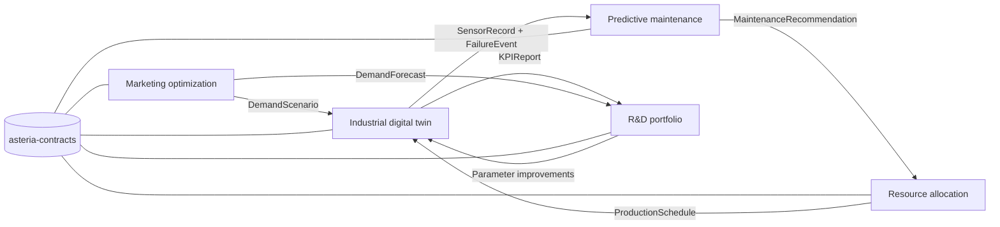
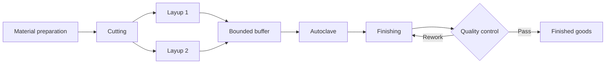

# Asteria Composites Lab

> A modular, reproducible industrial digital-twin demonstrator for composite panel manufacturing.

[English](README.md) · [Français](README_FR.md) · [Architecture EN](docs/architecture.md) · [Architecture FR](docs/architecture_FR.md) · [Roadmap](ROADMAP.md) · [License](LICENSE)

## Summary

Asteria Composites Lab models a fictional composite-panel factory to study production flow,
quality, maintenance, energy and decision-making under constraints. The first delivery is an
executable, laptop-scale foundation: versioned data contracts, a configurable process graph,
a seeded simulation, KPI exports, figures and automated tests.

All operational values currently shipped with the repository are **synthetic engineering
assumptions**. They are not measurements from a real factory.

## Business problem

Composite production combines long batch operations, shared specialists, bounded intermediate
storage, quality rework and equipment degradation. A local decision can move a bottleneck or
increase failure and quality risk elsewhere. The project provides a transparent environment for
testing these interactions before adding predictive-maintenance and optimization methods.

## Objectives

- Simulate series, parallel, branching and rework flows under finite capacity.
- Keep assumptions, units, provenance, seeds and schema versions explicit.
- Establish simple, testable baselines before introducing advanced methods.
- Exchange data through versioned contracts rather than uncontrolled cross-module imports.
- Run the `fast` demonstration and test suite on a standard laptop.

## Ecosystem map



## Module map

| Module | Business role | Baseline method | First-delivery status |
|---|---|---|---|
| `asteria_contracts` | Versioned data exchange and validation | Pydantic v2 + JSON Schema | Implemented |
| `asteria_digital_twin` | Factory flow, events, KPI and figures | Seeded discrete-event simulation | Minimal executable |
| Predictive maintenance | Failure risk and intervention policy | Thresholds, EWMA, Weibull | Planned — Phase 3 |
| Resource allocation | Operators, machines and maintenance slots | Greedy + CP-SAT | Planned — Phase 4 |
| Marketing optimization | Capacity-aware budget allocation | Saturation + adstock baseline | Planned — Phase 5 |
| R&D portfolio | Risk-aware project selection | MILP + Monte Carlo | Planned — Phase 6 |

## Inputs and outputs

| Layer | Inputs | Outputs |
|---|---|---|
| Contracts | YAML/JSON factory, products, orders and scenario | Validated Python objects and JSON schemas |
| Digital twin | Process graph, capacities, durations, quality, failures, seed | Event log, final state, machine history |
| Analytics | Events, orders and resource observations | Ten operational KPI and reproducibility metadata |
| Reporting | KPI, events and process topology | JSON/CSV files and PNG figures |

## Integrated example

The baseline models two panel references moving through material preparation, cutting, two parallel
layup stations, a shared preparation resource, a bounded buffer, autoclave curing, finishing and
quality control. Failed inspections enter a bounded rework loop. A degrading machine may fail;
maintenance restores part of its condition. A fixed random seed makes the example reproducible.



## Architecture

The launch architecture is a modular monorepo. It keeps one reproducible development environment
while preserving extraction boundaries through separate packages and versioned contracts.

```text
configs/                  # Factory and scenario YAML
data/examples/            # Small, readable synthetic examples
docs/                     # Architecture and scientific assumptions
schemas/                  # Exported JSON schemas
src/asteria_contracts/    # Shared versioned contracts
src/asteria_digital_twin/ # Graph, simulation, KPI, export and CLI
tests/                    # Unit, invariant and end-to-end tests
reports/                  # Generated reports and figures
```

See the architecture decision records
([EN](docs/architecture.md), [FR](docs/architecture_FR.md)) and the data-contract documentation
([EN](docs/data_contracts.md), [FR](docs/data_contracts_FR.md)). The complete module catalogue is
available in [English](docs/module_catalog.md) and [French](docs/module_catalog_FR.md).

## Methods

| Concern | Current baseline | Advanced extension | Inclusion rule |
|---|---|---|---|
| Production | Seeded discrete-event simulation | Robust scenario simulation | Only after flow invariants pass |
| Quality | Load-sensitive synthetic defect probability | Bayesian hierarchical model | Only with measurable calibration gain |
| Reliability | Cycle-dependent degradation and failure risk | State-space/survival model | Compare against thresholds and Weibull |
| Scheduling | Configured dispatch order | CP-SAT/robust optimization | Compare against greedy feasibility |
| Uncertainty | Controlled pseudo-random draws | Conformal/Bayesian intervals | Report coverage and compute cost |

## Data

The repository contains only small synthetic configuration and example files. Every contract includes
`schema_version` and provenance metadata. Units are declared in field names or validated unit fields.
The distinction between literature-derived models, engineering approximations and synthetic values is
documented in the scientific methodology
([EN](docs/scientific_methodology.md), [FR](docs/scientific_methodology_FR.md)) and industrial
assumptions ([EN](docs/industrial_assumptions.md), [FR](docs/industrial_assumptions_FR.md)).

## Installation

Requirements: Python 3.12 and [uv](https://docs.astral.sh/uv/).

```bash
git clone https://github.com/Mariusppgn/Digital-Tween-4.0-Industry-.git
cd Digital-Tween-4.0-Industry-
uv sync --extra dev
```

## Quick start

```bash
uv run asteria validate-config --config configs/scenarios/baseline.yaml
uv run asteria simulate --config configs/scenarios/baseline.yaml --output outputs/baseline
uv run asteria report --input outputs/baseline --output reports/generated
uv run pytest
```

Use `uv run asteria --help` for the command reference.

## Examples

Run the baseline twice with the same seed and compare `events.csv` and `kpis.json`: the model is
designed to produce identical results. Change the scenario seed or order mix to create a controlled
alternative. Configuration examples are in [`configs/`](configs/) and readable data examples are in
[`data/examples/`](data/examples/).

## Results

The simulation exports an event journal, final state and KPI report. This first delivery establishes
the execution and validation pipeline; it does not claim optimized industrial performance. Numerical
results depend on the explicitly synthetic baseline configuration.

| Measured item | Baseline result |
|---|---:|
| Accepted panels | `10` |
| Mean cycle time | `429.20 min` |
| Service rate | `1.00` |
| Defect rate including re-inspection | `0.1667` |
| Energy indicator | `1168.69 synthetic kWh` |
| Core simulation runtime | `0.002 s` |

## KPI

| KPI | Meaning | Initial validation |
|---|---|---|
| Quantity produced | Accepted finished orders | Reconciled with completion events |
| Service level | On-time deliveries / deliveries | Bounded in `[0, 1]` |
| Mean cycle time | Release-to-completion duration | Non-negative |
| Resource utilization | Busy time / available horizon | Bounded in `[0, 1]` |
| Defect rate | Failed inspections / inspections | Bounded in `[0, 1]` |
| Downtime | Failure and maintenance duration | Non-negative |
| Total cost | Processing, energy, quality and maintenance costs | Non-negative |
| Energy use | Simulated machine energy | Non-negative |
| Simplified OEE | Availability × performance × quality | Bounded in `[0, 1]` |
| Mean tardiness | Mean positive due-date overrun | Non-negative |

## Visualizations

The simulation generates reproducible figures without an interactive dashboard dependency:

- process graph;
- machine/event Gantt view;
- KPI or energy summary.

Stable example images will be committed after the baseline parameters are reviewed. Generated files
are written under `reports/figures/` or the selected output directory.

## Validation

```bash
uv run ruff check .
uv run mypy
uv run pytest
```

The suite checks contract validation, deterministic execution, graph topology, flow invariants,
non-negative values, KPI bounds, export generation and bilingual README structure. GitHub Actions
runs the same checks plus a `fast` smoke simulation.

## Performance

| Profile | Intended use | Budget | Current evidence |
|---|---|---:|---|
| `fast` | Tests and recruiter demonstration | `< 30 s` | `5.45 s` measured end to end; `0.002 s` simulation core |
| `standard` | Main scenario analysis | `< 2 min` for monthly replications | Planned benchmark |
| `research` | Optional deeper experiments | `< 5 min` per default configuration | Not implemented |

The `fast` measurement was made on Windows 11 with Python 3.12 and includes Matplotlib startup and
three PNG exports. Standard and research values remain budgets until multi-platform benchmarking.

## Limitations

- Parameters and sensor behaviour are synthetic and not plant-calibrated.
- The minimal simulator represents operational logic, not detailed composite physics.
- Human-resource calendars and batch compatibility are deliberately simplified.
- Predictive, scheduling, marketing and R&D optimizers are interfaces or roadmap items.
- Statistical validity cannot be inferred from the demonstration dataset.

## Roadmap

The detailed, acceptance-test-driven plan is maintained in [ROADMAP.md](ROADMAP.md). The next
increments instrument richer machine states, benchmark the `fast` profile, then compare corrective,
preventive and interpretable predictive-maintenance policies.

## Scientific references

Method selection and future references are tracked in the scientific methodology
([EN](docs/scientific_methodology.md), [FR](docs/scientific_methodology_FR.md)). References will be added only when a
specific law, estimator or algorithm is implemented; synthetic parameters are never presented as
literature values.

## License

Released under the [MIT License](LICENSE).
