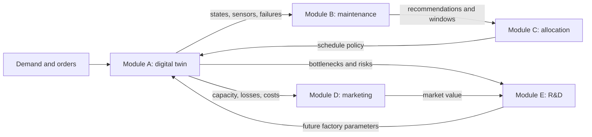

# SylvaPapers

> A modular and reproducible paper-mill digital twin, from raw wood to maintenance decisions.

[English](README.md) · [Français](README_FR.md) · [Architecture EN](docs/architecture.md) · [Architecture FR](docs/architecture_FR.md) · [Modules A/B EN](docs/modules_a_b.md) · [Modules A/B FR](docs/modules_a_b_FR.md) · [Inter-repository exports EN](docs/inter_repository_exports.md) · [Inter-repository exports FR](docs/inter_repository_exports_FR.md) · [Roadmap](ROADMAP.md) · [License](LICENSE)

## Summary

SylvaPapers models a fictional integrated paper mill. Module A simulates the configurable factory and
generates auditable operational, reliability and sensor data. Module B consumes those public outputs
to produce interpretable anomaly, failure-risk, remaining-life and maintenance-policy results.

All industrial values shipped in this repository are **synthetic engineering assumptions**. They are
not calibrated measurements and must not be used for real operational decisions.

## Ecosystem status

| Module | Business problem | Status in this increment |
|---|---|---|
| A — Digital twin | Simulate production, reliability, quality, energy and cost | Implemented baseline |
| B — Predictive maintenance | Detect drift, estimate failure risk and compare policies | Implemented interpretable baseline |
| C — Resource allocation | Schedule production, people and maintenance | Contracts and A/B inputs prepared |
| D — Marketing optimization | Convert capacity-aware demand into budget decisions | Contracts prepared; model not implemented |
| E — R&D portfolio | Select improvements under cost, resource and risk constraints | Contracts prepared; model not implemented |



## Factory workflow

The reference process combines serial operations, redundant machines and three recipe branches:

```mermaid
flowchart LR
    WOOD[Raw wood] --> DEB[Parallel debarking]
    DEB --> CHIP[Parallel chipping]
    CHIP --> BUF[Chip silo]
    BUF -->|kraft| KRAFT[Kraft cooking]
    BUF -->|printing| TMP[Thermomechanical pulp]
    BUF -->|board| BOARD[Board-pulp cooking]
    KRAFT --> WASH[Pulp washing]
    TMP --> WASH
    BOARD --> WASH
    WASH --> SCREEN[Screening]
    SCREEN --> BLEACH[Optional parallel bleaching]
    SCREEN --> STOCK[Stock preparation]
    BLEACH --> STOCK
    STOCK --> REFINE[Final refining]
    REFINE --> FORM[Sheet forming]
    FORM --> PRESS[Pressing]
    PRESS --> DRY[Parallel drying]
    DRY --> CAL[Calendering]
    CAL --> WIND[Parallel winding]
    WIND --> QC{Quality control}
    QC -->|accepted| ROLLS[Paper rolls]
    QC -->|rejected and recovered| STOCK
    QC -->|unrecoverable or loop limit| LOSS[Final measured losses]
```



The controlled quality-feedback loop returns eligible rejects to stock preparation. Recovery is a
seeded Bernoulli trial per `roll_equivalent`, with synthetic yield `0.75` and at most two passes.
Unrecovered rejects and rejects reaching the loop limit become final measured losses. This is a
unit-level accounting model, not a continuous pulp or broke mass balance.

## Module A — digital twin

The seeded discrete-event simulation covers three activatable paper products, conditional routes,
parallel equipment, machine operating age, two-parameter Weibull failures, repair and maintenance,
terminal quality losses, energy and cost. The current lightweight model tracks roll entities rather
than a continuous dry-tonne balance.

Its result bundle includes events, jobs, KPI and figures plus machine states, sensor records, failure
events, maintenance interventions, queue history, work in progress and final system state. Synthetic
sensors expose load, temperature, vibration, pressure, power, operating age and degradation.

The statistical campaign command runs 30 independent seeded replications of 1,000 planned rolls,
released every 45 minutes over an extended 90-day horizon. It exports all 15 KPI distributions,
empirical quantiles and normal-approximation 95% confidence intervals, plus product- and
machine-level tables designed for downstream repositories.

## Module B — predictive maintenance

The first maintenance baseline deliberately favors fast, interpretable methods:

- EWMA and two-sided CUSUM with robust thresholds for multivariate sensor drift;
- conditional Weibull risk from operating age and a configurable prediction horizon;
- lightweight remaining useful life with an uncertainty interval;
- explicit alerts and maintenance recommendations with traceable reasons;
- economic comparison of corrective, preventive and predictive policies;
- leakage-free rolling-origin backtesting with right-censoring, temporal confusion metrics and
  descriptive probability calibration.

These results are decision support only. They are evaluated against synthetic failures and synthetic
cost assumptions; no claimed accuracy transfers to a real mill without calibration.

## Module A to B contract

| Module A artefact | Main content | Module B use |
|---|---|---|
| `machine_states.csv` | status, utilization and active order by machine | operating context |
| `sensors.csv` | timestamped values, units and quality | EWMA anomaly evidence |
| `failures.csv` | failure mode, severity and downtime | outcome and policy evaluation |
| `maintenance.csv` | intervention type, timing and effect | maintenance history |
| `events.csv` | production and reliability event journal | traceability and alignment |
| `summary.json` | seed, versions, runtime and counts | reproducibility checks |

Module B imports only versioned contracts and persisted result files. It does not import simulator
internals, so both modules can be extracted into separate packages later.

## CSV exports for future Module D and E repositories

| File | Intended consumer | Grain and use |
|---|---|---|
| `module_d_product_statistics.csv` | Module D | product × replication; capacity, service, delay, loss and recycling evidence |
| `module_e_machine_statistics.csv` | Module E | machine × replication; utilization, failures, downtime, energy, emissions and cost |
| `kpi_statistics.csv` | Modules D and E | 15 campaign KPI summaries with quantiles and 95% confidence intervals |
| `machine_decision_features.csv` | Modules D and E | Module B risk, RUL, policy, cost and capacity-impact features |
| `handoff_manifest.json` | Modules D and E | file list, row counts, headers, consumers and SHA-256 checksums |

Every campaign exchange row carries `schema_version`, `producer_version`, `provenance` and
`data_classification`; units and compatibility rules live in `column_dictionary.json` or
`module_b_manifest.json`. Read the export
contract in [English](docs/inter_repository_exports.md) or
[French](docs/inter_repository_exports_FR.md) before copying these files into the future, separate
Module D and Module E repositories.

After generating the campaign and Module B analysis, create the compact handoff with:

```bash
uv run sylvapapers prepare-exchange --campaign outputs/long-run-statistics --maintenance outputs/long-run-maintenance --output exports/sylvapapers-handoff-v1
```

The command rejects incompatible schema majors or data classifications and atomically copies only
the public exchange files. `make exchange` runs the complete campaign → maintenance → handoff chain.

## Visual factory editor

Run [Lancer_SylvaPapers.bat](Lancer_SylvaPapers.bat) on Windows, or:

```bash
uv run sylvapapers factory-editor --factory configs/factory.yaml --port 8766
```

Then open `http://127.0.0.1:8766/`. The editor supports drag-and-drop and keyboard movement; add,
edit, duplicate and delete actions; material relations and explicit inputs/outputs; Weibull editing;
undo/redo; automatic layout; JSON import/export; validation; and explicit atomic writing.

## Installation

Prerequisites: Python 3.12 and [uv](https://docs.astral.sh/uv/).

```bash
uv sync --extra dev
```

## Quick start

```bash
uv run sylvapapers validate-config --config configs/scenarios/baseline.yaml
uv run sylvapapers simulate --config configs/scenarios/baseline.yaml --output outputs/baseline
uv run sylvapapers maintenance --input outputs/baseline --output outputs/maintenance
uv run sylvapapers campaign --config configs/campaigns/long_run.yaml --output outputs/long-run-statistics
uv run sylvapapers report --input outputs/baseline --output reports/generated
```

Use the optional maintenance configuration when comparing non-default thresholds, costs or horizons:

```bash
uv run sylvapapers maintenance --input outputs/baseline --output outputs/maintenance --config configs/maintenance/baseline.yaml
```

## Compute profiles

| Profile | Intended use | Default budget |
|---|---|---:|
| `fast` | tests, smoke runs and demonstrations | < 30 s per simple run |
| `standard` | main analysis and policy comparison | < 2 min for a multi-replication month |
| `research` | optional sensitivity and deeper experiments | < 5 min per default configuration |

These are laptop engineering guardrails, not production service-level agreements. Heavy methods stay
optional behind the same contracts.

## Repository map

```text
configs/                     # Factory, simulation and maintenance configurations
data/examples/               # Synthetic products and orders
docs/                        # Architecture, contracts, methods and assumptions (EN/FR)
outputs/long-run-statistics/ # Generated portable campaign exports (ignored by Git)
schemas/                     # Generated JSON Schemas
src/sylvapapers_contracts/   # Versioned Pydantic contracts
src/sylvapapers_digital_twin/# Module A, reporting and web editor
src/sylvapapers_maintenance/ # Module B maintenance analysis
tests/                       # Contracts, engines, editor and documentation parity
reports/                     # Delivery and generated experiment reports
```

## Validation

```bash
uv run ruff check .
uv run mypy
uv run pytest
```

The suite covers contracts, graph branches, active products, Weibull behavior, deterministic
simulation, instrumentation, measured losses, maintenance baselines, editor boundaries, JSON
interoperability, bounded recycling, long campaigns, temporal validation and bilingual documentation
structure.

## Scope and limits

- The factory is event-based and roll-based; continuous fibre, moisture and fluid physics are out of scope.
- Weibull, sensor, degradation, maintenance-cost and process coefficients are synthetic and uncalibrated.
- Recycling is Bernoulli per roll-equivalent and bounded to two passes; it is not continuous fibre recovery.
- EWMA/CUSUM are drift baselines, not diagnoses; Weibull risk depends on its modelling assumptions.
- Temporal predictions use past prefixes only and exclude right-censored windows from confusion and calibration metrics.
- Calendar contracts exist, but full workforce and maintenance-window enforcement remains future work.
- Modules C–E have prepared boundaries and contracts, but no optimizer is claimed as implemented;
  Modules D and E are intended to live in separate repositories and consume only exported files.
- SylvaPapers has no actuator or production-control interface and requires human review.

## License

Distributed under the [MIT License](LICENSE).
