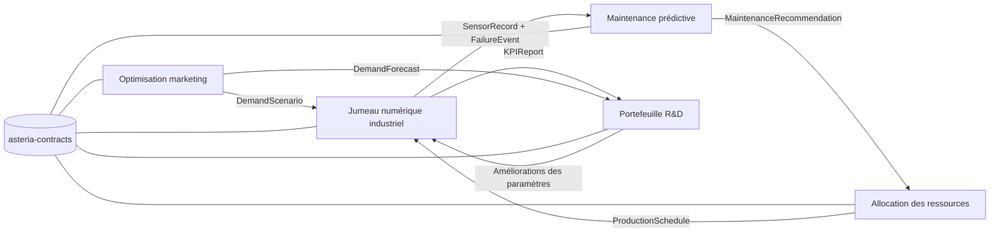
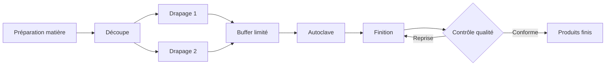

# Asteria Composites Lab

> Un démonstrateur modulaire et reproductible de jumeau numérique industriel pour la fabrication de panneaux composites.

[English](README.md) · [Français](README_FR.md) · [Architecture EN](docs/architecture.md) · [Architecture FR](docs/architecture_FR.md) · [Roadmap](ROADMAP.md) · [Licence](LICENSE)

## Résumé

Asteria Composites Lab modélise une usine fictive de panneaux composites pour étudier les flux de
production, la qualité, la maintenance, l’énergie et la décision sous contraintes. La première
livraison constitue un socle exécutable sur ordinateur portable : contrats de données versionnés,
graphe de procédé configurable, simulation avec graine, exports de KPI, figures et tests automatisés.

Toutes les valeurs opérationnelles livrées actuellement avec le dépôt sont des **hypothèses
d’ingénierie synthétiques**. Elles ne proviennent pas de mesures réalisées dans une usine réelle.

## Problème métier

La production de composites associe des opérations longues par lots, des spécialistes mutualisés, des
stocks intermédiaires limités, des reprises qualité et la dégradation des équipements. Une décision
locale peut déplacer un goulot ou accroître ailleurs les risques de panne et de non-qualité. Le projet
fournit un environnement transparent pour tester ces interactions avant d’ajouter la maintenance
prédictive et les méthodes d’optimisation.

## Objectifs

- Simuler les flux en série, en parallèle, avec bifurcation et reprise sous capacité finie.
- Rendre explicites les hypothèses, unités, provenances, graines et versions de schéma.
- Établir des baselines simples et testables avant d’introduire des méthodes avancées.
- Échanger les données par des contrats versionnés plutôt que par des imports croisés incontrôlés.
- Exécuter la démonstration `fast` et les tests sur un ordinateur portable standard.

## Carte de l’écosystème



## Carte des modules

| Module | Rôle métier | Méthode de base | État à la première livraison |
|---|---|---|---|
| `asteria_contracts` | Échange et validation de données versionnés | Pydantic v2 + JSON Schema | Implémenté |
| `asteria_digital_twin` | Flux usine, événements, KPI et figures | Simulation à événements discrets avec graine | Exécutable minimal |
| Maintenance prédictive | Risque de panne et politique d’intervention | Seuils, EWMA, Weibull | Prévu — Phase 3 |
| Allocation des ressources | Opérateurs, machines et créneaux de maintenance | Glouton + CP-SAT | Prévu — Phase 4 |
| Optimisation marketing | Allocation budgétaire limitée par la capacité | Baseline saturation + adstock | Prévu — Phase 5 |
| Portefeuille R&D | Sélection de projets tenant compte du risque | MILP + Monte-Carlo | Prévu — Phase 6 |

## Entrées et sorties

| Couche | Entrées | Sorties |
|---|---|---|
| Contrats | Usine, produits, commandes et scénario en YAML/JSON | Objets Python validés et schémas JSON |
| Jumeau numérique | Graphe de procédé, capacités, durées, qualité, pannes, graine | Journal d’événements, état final, historique machine |
| Analyse | Événements, commandes et observations des ressources | Dix KPI opérationnels et métadonnées de reproductibilité |
| Rapport | KPI, événements et topologie du procédé | Fichiers JSON/CSV et figures PNG |

## Exemple intégré

La baseline modélise deux références de panneaux traversant la préparation matière, la découpe, deux
postes parallèles de drapage, une ressource de préparation mutualisée, un buffer limité, la cuisson en
autoclave, la finition et le contrôle qualité. Les inspections non conformes rejoignent une boucle de
reprise limitée. Une machine dégradée peut tomber en panne ; la maintenance restaure une partie de
son état. Une graine aléatoire fixe rend l’exemple reproductible.



## Architecture

L’architecture de lancement est un monorepo modulaire. Elle conserve un environnement de
développement reproductible tout en préparant l’extraction des modules grâce à des packages séparés
et à des contrats versionnés.

```text
configs/                  # YAML de l’usine et des scénarios
data/examples/            # Petits exemples synthétiques lisibles
docs/                     # Architecture et hypothèses scientifiques
schemas/                  # Schémas JSON exportés
src/asteria_contracts/    # Contrats partagés versionnés
src/asteria_digital_twin/ # Graphe, simulation, KPI, export et CLI
tests/                    # Tests unitaires, invariants et bout en bout
reports/                  # Rapports et figures générés
```

Voir les décisions d’architecture
([EN](docs/architecture.md), [FR](docs/architecture_FR.md)) et la documentation des contrats
([EN](docs/data_contracts.md), [FR](docs/data_contracts_FR.md)). Le catalogue complet des modules est
disponible en [anglais](docs/module_catalog.md) et en [français](docs/module_catalog_FR.md).

## Méthodes

| Problématique | Baseline actuelle | Extension avancée | Règle d’inclusion |
|---|---|---|---|
| Production | Simulation à événements discrets avec graine | Simulation robuste par scénarios | Seulement après validation des invariants de flux |
| Qualité | Probabilité synthétique de défaut liée à la charge | Modèle bayésien hiérarchique | Seulement avec un gain mesurable de calibration |
| Fiabilité | Dégradation par cycle et risque de panne | Modèle espace-état ou de survie | Comparer aux seuils et à Weibull |
| Planification | Ordre de lancement configuré | CP-SAT ou optimisation robuste | Comparer à une heuristique faisable |
| Incertitude | Tirages pseudo-aléatoires contrôlés | Intervalles conformes ou bayésiens | Rapporter la couverture et le coût de calcul |

## Données

Le dépôt ne contient que de petits fichiers synthétiques de configuration et d’exemple. Chaque
contrat comprend `schema_version` et des métadonnées de provenance. Les unités sont déclarées dans
les noms de champs ou dans des champs d’unité validés. La distinction entre modèles issus de la
littérature, approximations d’ingénierie et valeurs synthétiques est documentée dans la
méthodologie scientifique
([EN](docs/scientific_methodology.md), [FR](docs/scientific_methodology_FR.md)) et les hypothèses
industrielles ([EN](docs/industrial_assumptions.md), [FR](docs/industrial_assumptions_FR.md)).

## Installation

Prérequis : Python 3.12 et [uv](https://docs.astral.sh/uv/).

```bash
git clone https://github.com/Mariusppgn/Digital-Tween-4.0-Industry-.git
cd Digital-Tween-4.0-Industry-
uv sync --extra dev
```

## Démarrage rapide

```bash
uv run asteria validate-config --config configs/scenarios/baseline.yaml
uv run asteria simulate --config configs/scenarios/baseline.yaml --output outputs/baseline
uv run asteria report --input outputs/baseline --output reports/generated
uv run pytest
```

Utiliser `uv run asteria --help` pour consulter la référence des commandes.

## Exemples

Exécuter deux fois la baseline avec la même graine et comparer `events.csv` et `kpis.json` : le modèle
est conçu pour produire des résultats identiques. Modifier la graine du scénario ou le mix de
commandes permet de créer une alternative contrôlée. Les exemples de configuration se trouvent dans
[`configs/`](configs/) et les données lisibles dans [`data/examples/`](data/examples/).

## Résultats

La simulation exporte un journal d’événements, l’état final et un rapport de KPI. Cette première
livraison établit la chaîne d’exécution et de validation ; elle ne revendique aucune performance
industrielle optimisée. Les résultats numériques dépendent de la configuration de base explicitement
synthétique.

| Élément mesuré | Résultat de la baseline |
|---|---:|
| Panneaux acceptés | `10` |
| Temps de cycle moyen | `429.20 min` |
| Taux de service | `1.00` |
| Taux de défaut avec réinspection | `0.1667` |
| Indicateur énergétique | `1168.69 kWh synthétiques` |
| Durée du cœur de simulation | `0.002 s` |

## KPI

| KPI | Signification | Validation initiale |
|---|---|---|
| Quantité produite | Commandes terminées et acceptées | Rapprochée des événements de fin |
| Taux de service | Livraisons à l’heure / livraisons | Borné dans `[0, 1]` |
| Temps de cycle moyen | Durée entre lancement et achèvement | Non négatif |
| Utilisation des ressources | Temps occupé / horizon disponible | Bornée dans `[0, 1]` |
| Taux de défaut | Inspections non conformes / inspections | Borné dans `[0, 1]` |
| Temps d’arrêt | Durée des pannes et maintenances | Non négatif |
| Coût total | Coûts de procédé, énergie, qualité et maintenance | Non négatif |
| Consommation d’énergie | Énergie machine simulée | Non négative |
| OEE simplifié | Disponibilité × performance × qualité | Borné dans `[0, 1]` |
| Retard moyen | Moyenne des dépassements positifs d’échéance | Non négatif |

## Visualisations

La simulation génère des figures reproductibles sans dépendance envers un tableau de bord interactif :

- graphe du procédé ;
- vue Gantt des machines et événements ;
- synthèse des KPI ou de l’énergie.

Des images d’exemple stables seront ajoutées après revue des paramètres de la baseline. Les fichiers
générés sont écrits dans `reports/figures/` ou dans le dossier de sortie choisi.

## Validation

```bash
uv run ruff check .
uv run mypy
uv run pytest
```

Les tests couvrent la validation des contrats, l’exécution déterministe, la topologie du graphe, les
invariants de flux, les valeurs non négatives, les bornes des KPI, la génération des exports et la
structure des README bilingues. GitHub Actions exécute les mêmes contrôles et une simulation `fast`.

## Performances

| Profil | Usage prévu | Budget | Preuve actuelle |
|---|---|---:|---|
| `fast` | Tests et démonstration recruteur | `< 30 s` | `5.45 s` mesurées de bout en bout ; `0.002 s` pour le cœur |
| `standard` | Analyse principale de scénarios | `< 2 min` pour les réplications mensuelles | Benchmark prévu |
| `research` | Expériences approfondies facultatives | `< 5 min` par configuration par défaut | Non implémenté |

La mesure `fast` a été réalisée sous Windows 11 avec Python 3.12 et inclut le démarrage de Matplotlib
et trois exports PNG. Les valeurs standard et research restent des budgets avant benchmark multiplateforme.

## Limites

- Les paramètres et le comportement des capteurs sont synthétiques et non calibrés sur une usine.
- Le simulateur minimal représente la logique opérationnelle, pas la physique détaillée des composites.
- Les calendriers humains et la compatibilité des lots sont volontairement simplifiés.
- Les optimiseurs de maintenance, planification, marketing et R&D sont des interfaces ou des éléments de roadmap.
- Aucune validité statistique ne peut être déduite du jeu de données de démonstration.

## Feuille de route

Le plan détaillé piloté par des critères d’acceptation est maintenu dans [ROADMAP.md](ROADMAP.md). Les
prochains incréments enrichissent l’instrumentation des états machine, mesurent le profil `fast`, puis
comparent les politiques de maintenance corrective, préventive et prédictive interprétable.

## Références scientifiques

Le choix des méthodes et les futures références sont suivis dans la méthodologie scientifique
([EN](docs/scientific_methodology.md), [FR](docs/scientific_methodology_FR.md)). Une référence ne sera ajoutée que
lorsqu’une loi, un estimateur ou un algorithme précis sera implémenté ; les paramètres synthétiques ne
sont jamais présentés comme des valeurs issues de la littérature.

## Licence

Distribué sous [licence MIT](LICENSE).
