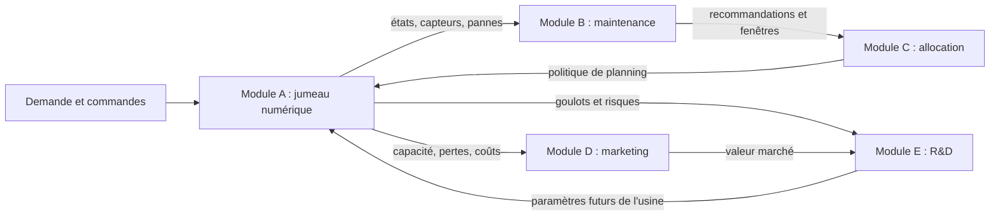

# SylvaPapers

> Un jumeau numérique modulaire et reproductible de papèterie, du bois brut aux décisions de maintenance.

[English](README.md) · [Français](README_FR.md) · [Architecture EN](docs/architecture.md) · [Architecture FR](docs/architecture_FR.md) · [Modules A/B EN](docs/modules_a_b.md) · [Modules A/B FR](docs/modules_a_b_FR.md) · [Roadmap](ROADMAP.md) · [Licence](LICENSE)

## Résumé

SylvaPapers modélise une papèterie intégrée fictive. Le Module A simule l'usine configurable et
génère des données opérationnelles, de fiabilité et de capteurs auditables. Le Module B consomme ces
sorties publiques pour produire des résultats interprétables d'anomalie, de risque de panne, de durée
de vie résiduelle et de politique de maintenance.

Toutes les valeurs industrielles livrées dans ce dépôt sont des **hypothèses d'ingénierie
synthétiques**. Ce ne sont pas des mesures étalonnées et elles ne doivent pas servir à des décisions
opérationnelles réelles.

## État de l'écosystème

| Module | Problème métier | État dans cet incrément |
|---|---|---|
| A — Jumeau numérique | Simuler production, fiabilité, qualité, énergie et coût | Baseline implémentée |
| B — Maintenance prédictive | Détecter les dérives, estimer le risque et comparer les politiques | Baseline interprétable implémentée |
| C — Allocation des ressources | Planifier production, personnel et maintenance | Contrats et entrées A/B préparés |
| D — Optimisation marketing | Transformer la demande contrainte par la capacité en décisions budgétaires | Contrats préparés ; modèle non implémenté |
| E — Portefeuille R&D | Sélectionner les améliorations sous contraintes de coût, ressources et risque | Contrats préparés ; modèle non implémenté |



## Flux de l'usine

Le procédé de référence combine opérations en série, machines redondantes et trois branches de recette :

```mermaid
flowchart LR
    WOOD[Bois brut] --> DEB[Écorçage parallèle]
    DEB --> CHIP[Déchiquetage parallèle]
    CHIP --> BUF[Silo à copeaux]
    BUF -->|kraft| KRAFT[Cuisson kraft]
    BUF -->|impression| TMP[Pâte thermomécanique]
    BUF -->|carton| BOARD[Cuisson pâte carton]
    KRAFT --> WASH[Lavage de pâte]
    TMP --> WASH
    BOARD --> WASH
    WASH --> SCREEN[Épuration]
    SCREEN --> BLEACH[Blanchiment parallèle facultatif]
    SCREEN --> STOCK[Préparation de pâte]
    BLEACH --> STOCK
    STOCK --> REFINE[Raffinage final]
    REFINE --> FORM[Formation de feuille]
    FORM --> PRESS[Pressage]
    PRESS --> DRY[Séchage parallèle]
    DRY --> CAL[Calandrage]
    CAL --> WIND[Bobinage parallèle]
    WIND --> QC{Contrôle qualité}
    QC -->|conforme| ROLLS[Rouleaux de papier]
    QC -->|rejeté| LOSS[Pertes mesurées]
```



Il n'existe aucune boucle de recyclage ou de reprise. Les rouleaux rejetés deviennent des pertes matière.

## Module A — jumeau numérique

La simulation à événements discrets avec graine couvre trois produits activables, des routes
conditionnelles, des équipements parallèles, l'âge de fonctionnement, les pannes Weibull à deux
paramètres, la réparation et la maintenance, les pertes qualité terminales, l'énergie et le coût. Le
modèle léger actuel suit des rouleaux plutôt qu'un bilan continu en tonnes sèches.

Son paquet de résultats inclut événements, jobs, KPI et figures, ainsi que les états machine, relevés
capteurs, pannes, interventions de maintenance, historique des files, encours et état final. Les
capteurs synthétiques exposent charge, température, vibration, pression, puissance, âge et dégradation.

## Module B — maintenance prédictive

La première baseline de maintenance privilégie volontairement des méthodes rapides et interprétables :

- EWMA et seuils robustes pour les dérives multivariées des capteurs ;
- risque Weibull conditionnel à partir de l'âge et d'un horizon configurable ;
- durée de vie résiduelle légère avec intervalle d'incertitude ;
- alertes et recommandations explicites avec raisons traçables ;
- comparaison économique des politiques corrective, préventive et prédictive.

Ces résultats constituent uniquement une aide à la décision. Ils sont évalués sur des pannes et coûts
synthétiques ; aucune précision annoncée ne se transfère à une papèterie réelle sans étalonnage.

## Contrat du Module A vers B

| Artefact du Module A | Contenu principal | Usage par le Module B |
|---|---|---|
| `machine_states.csv` | statut, utilisation et commande active par machine | contexte de fonctionnement |
| `sensors.csv` | valeurs horodatées, unités et qualité | preuves d'anomalie EWMA |
| `failures.csv` | mode, gravité et arrêt de chaque panne | résultat et évaluation des politiques |
| `maintenance.csv` | type, date et effet de l'intervention | historique de maintenance |
| `events.csv` | journal des événements production et fiabilité | traçabilité et alignement |
| `summary.json` | graine, versions, durée et comptes | contrôles de reproductibilité |

Le Module B importe uniquement les contrats versionnés et les résultats persistés. Il n'importe pas
les composants internes du simulateur : les deux modules pourront donc devenir des packages séparés.

## Éditeur visuel de l'usine

Sous Windows, lancer [Lancer_SylvaPapers.bat](Lancer_SylvaPapers.bat), ou :

```bash
uv run sylvapapers factory-editor --factory configs/factory.yaml --port 8766
```

Ouvrir ensuite `http://127.0.0.1:8766/`. L'éditeur prend en charge glisser-déposer et clavier ; ajout,
modification, duplication et suppression ; relations matière et entrées/sorties explicites ; Weibull ;
annuler/rétablir ; agencement automatique ; import/export JSON ; validation ; écriture atomique explicite.

## Installation

Prérequis : Python 3.12 et [uv](https://docs.astral.sh/uv/).

```bash
uv sync --extra dev
```

## Démarrage rapide

```bash
uv run sylvapapers validate-config --config configs/scenarios/baseline.yaml
uv run sylvapapers simulate --config configs/scenarios/baseline.yaml --output outputs/baseline
uv run sylvapapers maintenance --input outputs/baseline --output outputs/maintenance
uv run sylvapapers report --input outputs/baseline --output reports/generated
```

Utiliser la configuration de maintenance facultative pour comparer des seuils, coûts ou horizons non standards :

```bash
uv run sylvapapers maintenance --input outputs/baseline --output outputs/maintenance --config configs/maintenance/baseline.yaml
```

## Profils de calcul

| Profil | Usage prévu | Budget par défaut |
|---|---|---:|
| `fast` | tests, vérifications et démonstrations | < 30 s par exécution simple |
| `standard` | analyse principale et comparaison de politiques | < 2 min pour un mois multiréplication |
| `research` | sensibilités facultatives et expériences approfondies | < 5 min par configuration par défaut |

Ces valeurs sont des garde-fous pour ordinateur portable, pas des engagements de service. Les
méthodes lourdes restent facultatives derrière les mêmes contrats.

## Carte du dépôt

```text
configs/                     # Configurations d'usine, simulation et maintenance
data/examples/               # Produits et commandes synthétiques
docs/                        # Architecture, contrats, méthodes et hypothèses (EN/FR)
schemas/                     # Schémas JSON générés
src/sylvapapers_contracts/   # Contrats Pydantic versionnés
src/sylvapapers_digital_twin/# Module A, rapports et éditeur web
src/sylvapapers_maintenance/ # Analyse de maintenance du Module B
tests/                       # Contrats, moteurs, éditeur et parité documentaire
reports/                     # Rapports de livraison et d'expériences générés
```

## Validation

```bash
uv run ruff check .
uv run mypy
uv run pytest
```

La suite couvre contrats, branches du graphe, produits actifs, comportement Weibull, simulation
déterministe, instrumentation, pertes mesurées, baselines de maintenance, frontières de l'éditeur,
interopérabilité JSON et structure bilingue de la documentation.

## Périmètre et limites

- L'usine est événementielle et suit des rouleaux ; la physique continue fibre, humidité et fluides est hors périmètre.
- Les coefficients Weibull, capteurs, dégradation, coûts de maintenance et procédé sont synthétiques et non étalonnés.
- EWMA est une baseline de dérive, pas un diagnostic ; le risque Weibull dépend de ses hypothèses.
- Les contrats de calendrier existent, mais leur application complète au personnel et à la maintenance reste future.
- Les Modules C–E ont des frontières et contrats préparés, mais aucun optimiseur n'est annoncé comme implémenté.
- SylvaPapers n'a aucune interface actionneur ou de commande de production et exige une revue humaine.

## Licence

Distribué sous [licence MIT](LICENSE).
