# SylvaPapers

> Un jumeau numérique de papèterie configurable et reproductible, du bois brut aux rouleaux finis.

[English](README.md) · [Français](README_FR.md) · [Architecture EN](docs/architecture.md) · [Architecture FR](docs/architecture_FR.md) · [Roadmap](ROADMAP.md) · [Licence](LICENSE)

## Résumé

SylvaPapers modélise une papèterie intégrée fictive. Sa configuration d'usine décrit les types de
machines, les machines physiques, les entrées et sorties matière, les relations du procédé, les
positions dans l'éditeur et les densités de panne Weibull à deux paramètres. L'éditeur web local
permet de modifier cette configuration sans écrire le YAML à la main.

Toutes les valeurs industrielles livrées dans ce dépôt sont des **hypothèses d'ingénierie
synthétiques**. Ce ne sont pas des mesures étalonnées et elles ne doivent pas servir à des décisions
opérationnelles réelles.

## Flux de l'usine

Le procédé de référence combine opérations en série, machines redondantes et trois branches de recette :

```mermaid
flowchart LR
    WOOD[Bois brut] --> DEB[Écorçage parallèle]
    DEB --> CHIP[Déchiquetage parallèle]
    CHIP --> BUF[Silo à copeaux]
    BUF -->|kraft| KRAFT[Cuisson kraft]
    BUF -->|impression| TMP[Pâte thermomécanique]
    BUF -->|carton| BOARD[Cuisson pâte carton]
    KRAFT --> WASH[Lavage de pâte]
    TMP --> WASH
    BOARD --> WASH
    WASH --> SCREEN[Épuration]
    SCREEN --> BLEACH[Blanchiment parallèle facultatif]
    SCREEN --> STOCK[Préparation de pâte]
    BLEACH --> STOCK
    STOCK --> REFINE[Raffinage final]
    REFINE --> FORM[Formation de feuille]
    FORM --> PRESS[Pressage]
    PRESS --> DRY[Séchage parallèle]
    DRY --> CAL[Calandrage]
    CAL --> WIND[Bobinage parallèle]
    WIND --> QC{Contrôle qualité}
    QC -->|conforme| ROLLS[Rouleaux de papier]
    QC -->|rejeté| LOSS[Pertes mesurées]
```



Il n'existe aucune boucle de recyclage ou de reprise. Les rouleaux rejetés deviennent des pertes matière.

## Produits configurables

La baseline définit trois produits. `kraft-paper-roll` et `printing-paper-roll` sont actifs ;
`board-paper-roll` est initialement désactivé. Modifiez `enabled` dans le scénario et ajoutez des
commandes pour activer un produit. Toute commande visant un produit désactivé est rejetée à la validation.

## Modèle de fiabilité

Chaque machine référence un type déclaré. Tous les types utilisent la même famille Weibull à deux
paramètres et ne changent que :

- `shape` (β), qui représente le profil du taux de panne ;
- `scale_hours` (η), exprimé en heures de fonctionnement.

Le simulateur calcule pour chaque opération une probabilité conditionnelle de panne à partir de l'âge
de fonctionnement cumulé. La maintenance réduit partiellement cet âge virtuel selon la configuration
de la machine. Tous les coefficients de la baseline sont synthétiques.

## Éditeur visuel de l'usine

Lancer l'éditeur local :

```bash
uv run sylvapapers factory-editor --factory configs/factory.yaml
```

Ouvrir ensuite `http://127.0.0.1:8765/`. L'éditeur prend en charge :

- le glisser-déposer et le déplacement au clavier ;
- l'ajout, la modification, la duplication et la suppression d'étapes ou de machines ;
- la création et la suppression de relations matière ;
- les entrées et sorties matière explicites pour chaque étape ;
- les coefficients Weibull par type de machine ;
- annuler, rétablir et un agencement automatique simple ;
- l'import/export JSON ;
- la validation navigateur et serveur avant une écriture atomique explicite.

## Carte du dépôt

```text
configs/                     # Usine et scénario combiné YAML
data/examples/               # Scénario synthétique de produits et commandes
docs/                        # Architecture, contrats et hypothèses (EN/FR)
schemas/                     # Schémas JSON générés
src/sylvapapers_contracts/   # Contrats Pydantic versionnés
src/sylvapapers_digital_twin/# Graphe, simulation, KPI, rapports et éditeur web
tests/                       # Tests contrats, moteur, éditeur et parité
reports/                     # Rapport de livraison et rapports générés
```

## Installation

Prérequis : Python 3.12 et [uv](https://docs.astral.sh/uv/).

```bash
uv sync --extra dev
```

## Démarrage rapide

```bash
uv run sylvapapers validate-config --config configs/scenarios/baseline.yaml
uv run sylvapapers simulate --config configs/scenarios/baseline.yaml --output outputs/baseline
uv run sylvapapers report --input outputs/baseline --output reports/generated
uv run pytest
```

## Sorties et KPI

La simulation exporte événements, commandes, KPI, résumé de reproductibilité et figures facultatives.
Onze KPI couvrent quantité acceptée, service, cycle, utilisation, défauts, pertes matière, arrêts,
coûts, énergie, OEE simplifié et retard.

## Validation

```bash
uv run ruff check .
uv run mypy
uv run pytest
```

La suite vérifie les contrats, les branches du graphe, les produits actifs, le comportement Weibull,
la simulation déterministe, les pertes mesurées, la sécurité et les interactions de l'éditeur,
l'interopérabilité JSON et la structure bilingue de la documentation.

## Périmètre et limites

- Le flux est simulé par rouleau ; la physique continue des fluides et fibres est hors de cet incrément.
- Les coefficients Weibull et valeurs de procédé sont synthétiques, non étalonnés.
- Les branches alternatives et capacités redondantes sont prises en charge ; un job suit une gamme produit.
- Les calendriers sont contractuels mais ne sont pas encore appliqués par le simulateur léger.
- L'outil est consultatif et ne possède aucune interface de commande des équipements.

## Licence

Distribué sous [licence MIT](LICENSE).
