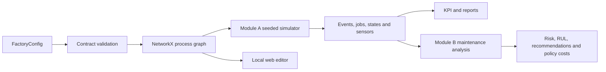

# SylvaPapers — Architecture

## 1. Purpose

SylvaPapers is a local Python 3.12 monorepo for reproducible paper-mill experiments. Module A
simulates the factory; Module B analyzes predictive-maintenance evidence. The factory configuration
and public contracts are their shared source of truth.

## 2. Modular monorepo decision

The monorepo supports atomic contract, engine, test and documentation changes while the ecosystem is
young. Separability is preserved through package boundaries, versioned Pydantic models and persisted
files. A module may consume contracts and files from another module, but it must not import another
module's private implementation.

## 3. Package boundaries

- `sylvapapers_contracts`: strict data contracts and JSON Schema export.
- `sylvapapers_digital_twin`: Module A graph, simulation, instrumentation, KPI and reports.
- predictive-maintenance components: Module B loading, EWMA, Weibull risk, RUL, economics and reports.
- local web editor: factory configuration editing behind the same `FactoryConfig` boundary.

The contracts package imports no business package. Modules C–E will depend on public contracts and
persisted outputs rather than simulator internals.

## 4. Factory graph



Process nodes persist material inputs, outputs and editor coordinates. Forward edges persist
material, condition and probability and remain acyclic. One separately typed, validated and bounded
recycle edge closes the controlled quality loop from `quality-control` to `stock-preparation`.

## 5. Series, parallel and state behavior

Parallel capacity is represented by several physical `machine_ids` assigned to one operation.
Alternative product recipes are represented by conditional graph branches. Each physical machine
maintains its own operating age, availability, degradation, state and sensor history. Queue and WIP
observations expose accumulation without turning the model into a continuous mass balance.

## 6. Reliability and instrumentation

Each machine type owns a two-parameter Weibull density. Module A computes conditional failure risk
from operating age, advances degradation during work and emits structured states, sensors, failures
and maintenance events. A seeded random generator makes synthetic histories reproducible.

The public sensor set comprises load, temperature, vibration, pressure, power, operating age and
degradation. Units and quality labels travel with each record.

## 7. Module A to B boundary

```text
configs + orders
  -> Module A validation and simulation
  -> events.csv + jobs.csv + machine_states.csv + sensors.csv
  -> failures.csv + maintenance.csv + recycling.csv + queues.csv + work_in_progress.csv
  -> Module B input validation
  -> EWMA/CUSUM + conditional Weibull risk + RUL + temporal/economic evaluation
  -> maintenance results, recommendations, figures and reproducibility summary
```

Module B is read-only with respect to Module A outputs. It produces advisory artefacts in a separate
output directory and never mutates the source simulation bundle.

## 8. Editor and security boundary

The editor server binds to `127.0.0.1` by default, serves allow-listed assets, validates payloads
through `FactoryConfig`, limits request size and writes only the configured file. Browser changes
must be validated before explicit writing. This local boundary is not an authorization model for
shared or production deployment.

## 9. Future module integration

- Module B recommendations and windows become constraints for Module C resource allocation.
- Module C schedules return to Module A as simulation policies for stochastic validation.
- Module D demand scenarios enter Module A and consume capacity-aware service and cost evidence.
- Module E consumes bottlenecks, failure risk and costs, then proposes future parameter changes.
- Every exchange must use versioned contracts with explicit units, provenance and schema version.

## 10. Acceptance criteria

- every enabled product has a valid source-to-sink route;
- physical machines retain independent age, state and event identity;
- Module A emits contract-valid operational and condition-monitoring bundles;
- Module B rejects incomplete inputs and returns traceable machine-level results;
- every machine type exposes positive Weibull shape and scale;
- rejected units are accepted only after successful bounded recycling and final quality control;
- unrecovered rejects and rejects reaching the two-loop limit are recorded as final losses;
- equal validated inputs and seed reproduce equal synthetic results;
- tests, Ruff, strict mypy and bilingual documentation parity pass.
