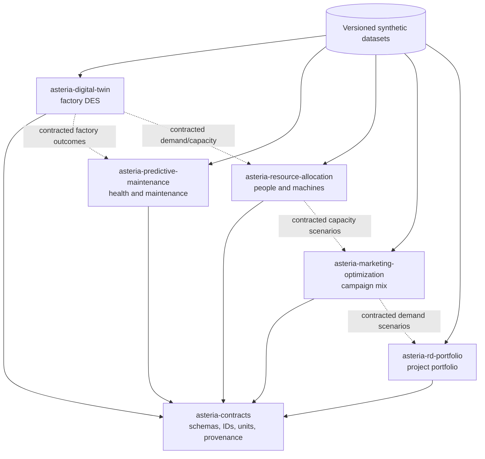
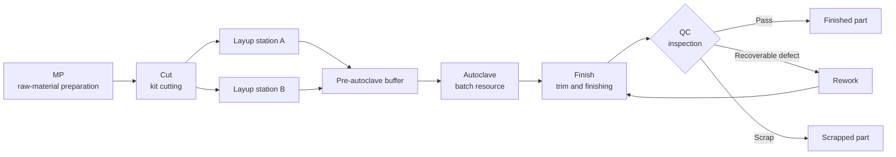
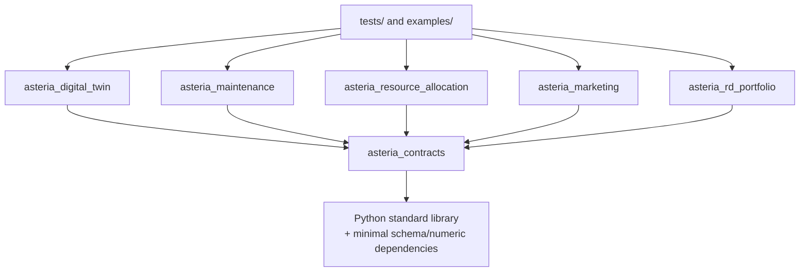
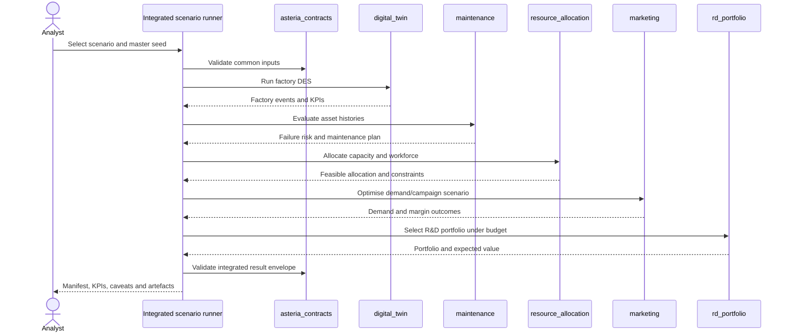
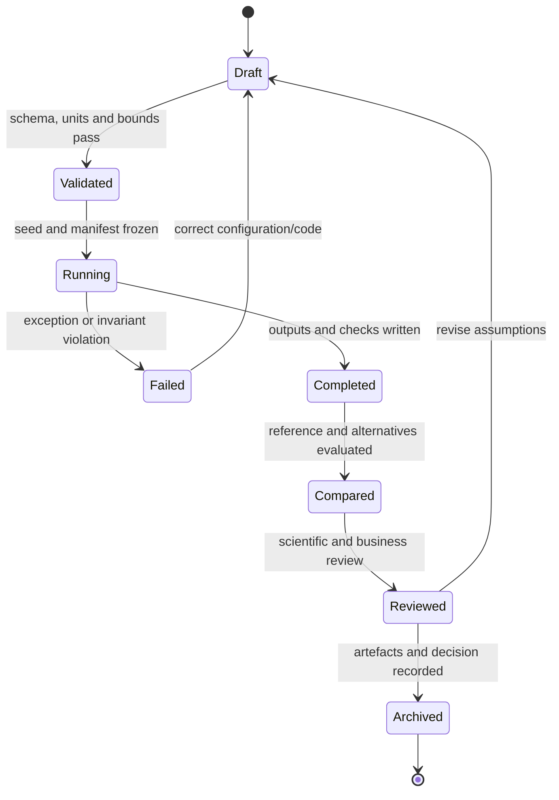

# Asteria Composites Lab — Architecture

## 1. Purpose and scope

Asteria is a lightweight Python monorepo for reproducible Industry 4.0 experiments around a synthetic composites factory. Five business projects share stable contracts and datasets, but remain independently executable:

1. `asteria-digital-twin` — discrete-event simulation (DES) of the production line;
2. `asteria-predictive-maintenance` — asset health and maintenance prioritisation;
3. `asteria-resource-allocation` — constrained assignment of people and machines;
4. `asteria-marketing-optimization` — campaign and commercial-mix experiments;
5. `asteria-rd-portfolio` — R&D project scoring and portfolio selection.

`asteria-contracts` contains their shared schemas, identifiers, units, result envelopes, and provenance rules. This first iteration is local, deterministic, batch-oriented and intentionally excludes microservices, distributed queues, real-time control and cloud infrastructure.

## 2. Architectural principles

- **One Python monorepo, six installable packages:** source lives under `src/`, with a common test and tooling policy.
- **Contracts before coupling:** business packages exchange validated contract objects or files; they never import another business package.
- **Discrete events before false precision:** the factory twin models queues, resources, failures and routing decisions, not detailed material physics.
- **Deterministic experiments:** configuration, seed, code revision, dataset version and outputs are captured for every run.
- **Small operational footprint:** in-process execution and files/SQLite-compatible persistence are sufficient for the first iteration.
- **Synthetic-by-default:** all generated records carry explicit provenance and must not be presented as plant evidence.

## 3. Diagram 1 — ecosystem: five business modules and contracts



The dotted arrows represent data exchange through contract-compliant artefacts, not Python imports.

## 4. Diagram 2 — composites production line



Entities are manufacturing orders or parts. Stations expose capacity, processing-time distributions, calendars, setup rules and failure state. Parallel layup stations compete for upstream kits and feed a finite buffer. The autoclave is a batch resource. QC routes parts to completion, rework or scrap; rework count is bounded to prevent infinite loops.

## 5. Diagram 3 — data flow

```mermaid
flowchart LR
  Source["Scenario YAML/JSON\n+ synthetic seed data"] --> Validate["asteria_contracts\nvalidate and normalise"]
  Validate --> Run["Selected business module\npure Python execution"]
  Run --> Events["Immutable event/result records"]
  Events --> Check["Quality, invariants\nand plausibility checks"]
  Check --> KPI["Derived KPIs and decisions"]
  KPI --> Manifest["Experiment manifest\nversions, seed, hashes"]
  Manifest --> Artefacts[("Local JSON/CSV/Parquet artefacts")]
  Artefacts --> Compare["Cross-scenario comparison"]
  Compare --> Report["Human-readable report"]
```



Raw inputs and emitted events are immutable. Transformations create new versioned artefacts. UTC is used for absolute timestamps, simulated time is expressed as a non-negative offset, and units are explicit. Reports link back to the manifest and source hashes.

## 6. Diagram 4 — allowed dependencies



`asteria_contracts` imports no business package. Business packages may depend on contracts and approved third-party libraries, but not on each other. Integrated examples orchestrate public APIs and contract artefacts from outside the packages. Imports from tests, examples, notebooks, or generated outputs into `src/` are forbidden. Dependency cycles fail CI.

## 7. Diagram 5 — integrated scenario sequence



The sequence is an offline experiment, not an operational feedback loop. Each step consumes an immutable snapshot and emits a new contract-compliant result. A failed module leaves a diagnostic record and prevents downstream conclusions from being labelled complete.

## 8. Diagram 6 — experiment lifecycle



Transitions are explicit and auditable. Completed outputs are not overwritten; a change creates a new experiment identifier. Review records limitations, rejected alternatives and whether the result is only demonstrative or supports a bounded decision.

## 9. Repository layout

```text
src/
  asteria_contracts/
  asteria_digital_twin/
  asteria_maintenance/
  asteria_resource_allocation/
  asteria_marketing/
  asteria_rd_portfolio/
tests/
  unit/
  integration/
examples/
data/
  synthetic/
docs/
```

Each package exposes a narrow public API from its package root. Configuration loading, random-number creation and file output stay at package boundaries; core calculations accept typed values and explicit random generators. Shared code enters `asteria_contracts` only when it represents a genuine cross-domain contract, not merely to avoid duplication.

## 10. Architectural decisions

| Decision | First-iteration choice | Rationale |
|---|---|---|
| Runtime | Supported CPython, one local process per experiment | Easy installation, debugging and reproducibility |
| Factory model | Discrete-event simulation with seeded distributions | Represents flow, queues, batching, failures and rework |
| Integration | Contracted files/objects coordinated by examples | Keeps business projects independent without distributed systems |
| Persistence | Versioned local artefacts; optional lightweight metadata index | Inspectable, portable and sufficient for experiment scale |
| Configuration | Validated YAML/JSON mapped to typed contracts | Human-readable inputs and machine-checkable boundaries |
| Randomness | Master seed with stable derived seeds per module | Repeatability without accidental cross-module coupling |
| Time | UTC for observations; explicit simulated time for DES | Avoids conflating wall-clock and model time |
| Errors | Structured diagnostics and fail-fast invariants | Prevents partial results from looking authoritative |

## 11. Risks and mitigations

| Risk | Consequence | Mitigation |
|---|---|---|
| Synthetic factory is mistaken for the real plant | Invalid operational decisions | Prominent provenance, documented assumptions and no production claim |
| Cross-module semantics drift | Integrated scenario becomes incoherent | Shared contracts, compatibility tests and versioned examples |
| DES becomes over-detailed | Slow, untestable model with false precision | Model only decision-relevant queues, resources and events |
| Random results are not reproducible | Comparisons cannot be audited | Master/derived seeds, manifests, hashes and tolerance-based tests |
| Optimisers exploit unrealistic assumptions | Attractive but infeasible recommendations | Hard constraints, baseline comparison and domain review |
| A common package becomes a dumping ground | Hidden coupling | Contract-only admission rule and ownership review |
| Local artefacts grow without bounds | Slow tests and repository bloat | Size limits, summaries, ignored generated outputs and retention policy |

## 12. Deferred decisions

- Calibration against confidential plant histories awaits an approved, anonymised dataset.
- Real-time ingestion, edge connectivity, OPC UA/MQTT and MES integration are out of scope.
- Microservices, distributed execution, managed databases and cloud deployment are not justified for this iteration.
- The definitive optimisation solvers and commercial licences remain open until benchmark size and constraints are stable.
- Production identity, access control, retention and regulatory qualification require an industrial deployment decision.
- Detailed cure physics, finite-element models and closed-loop equipment control are explicitly excluded.

## 13. Acceptance criteria

The architecture is accepted when each business project runs independently from a documented Python entry point, imports only contracts among Asteria packages, produces deterministic contract-valid artefacts from a fixed seed, and participates in one offline integrated scenario. The factory DES must reproduce the declared MP → cut → parallel layup → buffer → autoclave → finish → QC → rework flow, enforce finite capacities and bounded rework, and expose event/KPI invariants. Tests must detect dependency cycles, invalid contracts, non-deterministic replay and incomplete manifests.
