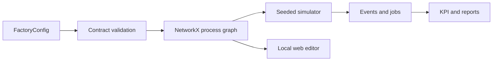

# SylvaPapers — Architecture

## 1. Purpose

SylvaPapers is a local Python 3.12 monorepo for reproducible paper-mill experiments. The factory
configuration is the shared source of truth for machines, machine types, materials and graph layout.

## 2. Package boundaries

- `sylvapapers_contracts`: strict Pydantic contracts and JSON Schema export.
- `sylvapapers_digital_twin`: graph adapter, simulation, reliability, KPI, reporting and web editor.

The contracts package imports no business package. The twin depends on contracts, NetworkX and
standard scientific libraries.

## 3. Factory graph



Process nodes persist material inputs, outputs and editor coordinates. Edges persist material,
condition and probability. Cycles are permitted by the generic contract, but the SylvaPapers
baseline is acyclic and contains no recycling route.

## 4. Series and parallel behavior

Parallel capacity is represented by several physical `machine_ids` assigned to one operation.
Alternative product recipes are represented by conditional graph branches. When a product has no
explicit routing, the simulator derives a deterministic route using `metadata.route_condition`.

## 5. Reliability

Each machine type owns a two-parameter Weibull density. The simulator tracks operating age and
computes conditional failure probability for the next operation interval. A seeded random generator
makes the event history reproducible.

## 6. Editor boundary

The editor server binds to `127.0.0.1` by default, serves only allow-listed assets, validates every
payload through `FactoryConfig`, limits request size and writes only the configured file. Browser
changes must be validated before the explicit write action becomes available.

## 7. Data flow

```text
factory.yaml + simulation_scenario.json
  -> Pydantic validation
  -> editable process graph / seeded simulation
  -> events.csv + jobs.csv + kpis.json + summary.json + figures
```

## 8. Acceptance criteria

- a source-to-sink paper route exists for every enabled product;
- all referenced machines and machine types exist;
- every machine type exposes positive Weibull shape and scale;
- no enabled order targets a disabled product;
- losses are measured without recycling;
- editor import/export preserves graph positions and materials;
- tests, Ruff and strict mypy pass.
