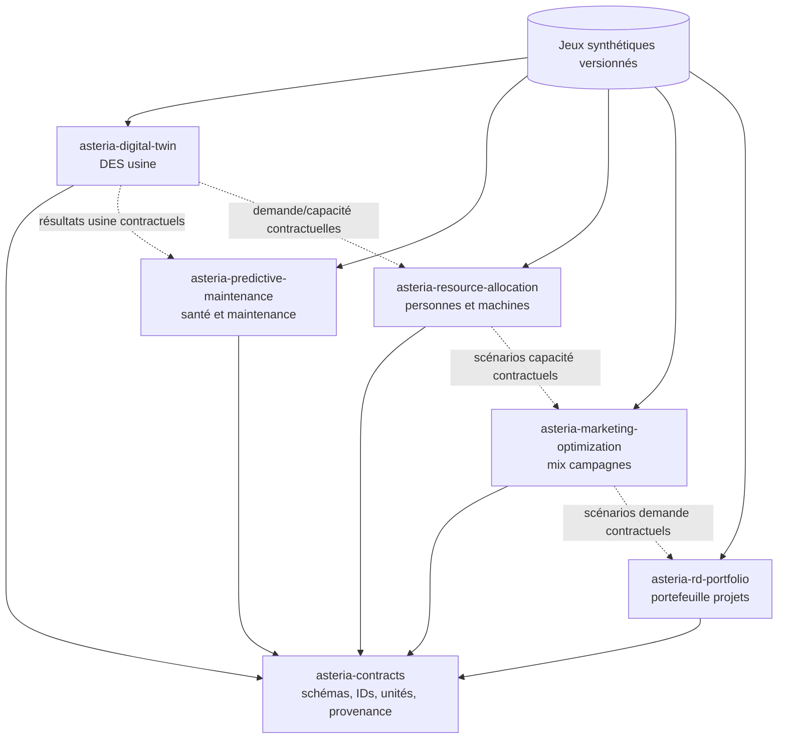
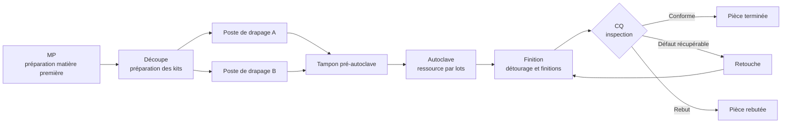
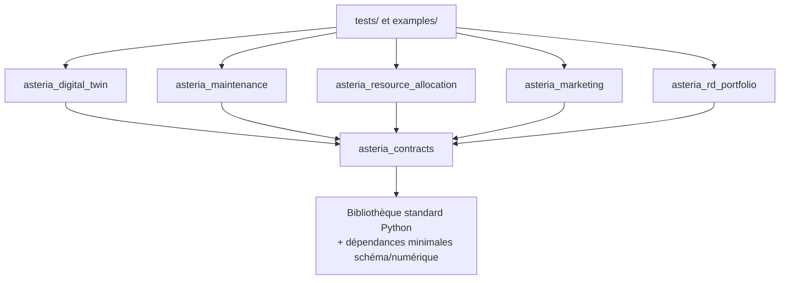
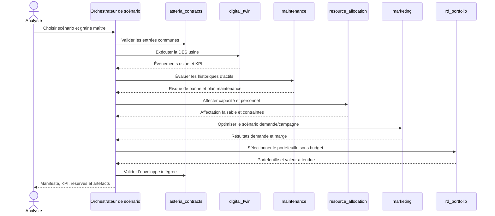
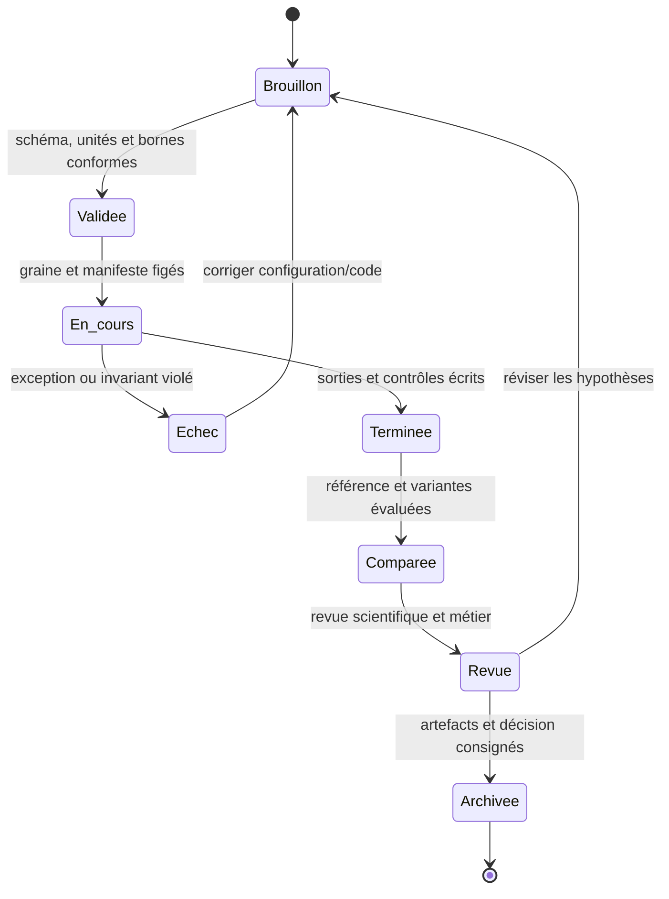

# Asteria Composites Lab — Architecture

## 1. Objectif et périmètre

Asteria est un monorepo Python léger destiné à des expériences Industrie 4.0 reproductibles autour d’une usine de composites synthétique. Cinq projets métier partagent des contrats et jeux de données stables tout en restant exécutables indépendamment :

1. `asteria-digital-twin` — simulation à événements discrets (DES) de la ligne de production ;
2. `asteria-predictive-maintenance` — santé des actifs et priorisation de maintenance ;
3. `asteria-resource-allocation` — affectation contrainte des personnes et machines ;
4. `asteria-marketing-optimization` — expériences de campagnes et de mix commercial ;
5. `asteria-rd-portfolio` — notation et sélection d’un portefeuille R&D.

`asteria-contracts` contient schémas, identifiants, unités, enveloppes de résultats et règles de provenance partagés. Ce premier jet est local, déterministe, orienté traitement par lots et exclut volontairement microservices, files distribuées, commande temps réel et infrastructure cloud.

## 2. Principes d’architecture

- **Un monorepo Python, six paquets installables :** le code réside sous `src/`, avec une politique commune de tests et d’outillage.
- **Contrats avant couplage :** les paquets métier échangent des objets ou fichiers validés ; ils ne s’importent jamais mutuellement.
- **Événements discrets avant fausse précision :** le jumeau usine modélise files, ressources, pannes et routages, non la physique détaillée des matériaux.
- **Expériences déterministes :** configuration, graine, révision du code, version des données et sorties sont capturées à chaque exécution.
- **Empreinte opérationnelle réduite :** exécution en processus et persistance par fichiers/compatible SQLite suffisent au premier jet.
- **Synthétique par défaut :** chaque enregistrement généré porte une provenance explicite et ne doit pas être présenté comme preuve usine.

## 3. Diagramme 1 — écosystème : cinq modules métier et contrats



Les flèches pointillées représentent des échanges par artefacts conformes aux contrats, non des imports Python.

## 4. Diagramme 2 — ligne de production composites



Les entités sont des ordres de fabrication ou des pièces. Les postes exposent capacité, distributions de durée, calendriers, règles de changement de série et état de panne. Les postes de drapage parallèles se partagent les kits amont et alimentent un tampon fini. L’autoclave est une ressource par lots. Le contrôle qualité oriente vers achèvement, retouche ou rebut ; le nombre de retouches est borné pour empêcher les boucles infinies.

## 5. Diagramme 3 — flux de données

```mermaid
flowchart LR
  Source["Scénario YAML/JSON\n+ données synthétiques ensemencées"] --> Validate["asteria_contracts\nvalidation et normalisation"]
  Validate --> Run["Module métier sélectionné\nexécution Python pure"]
  Run --> Events["Événements/résultats immuables"]
  Events --> Check["Contrôles qualité, invariants\net plausibilité"]
  Check --> KPI["KPI et décisions dérivés"]
  KPI --> Manifest["Manifeste d’expérience\nversions, graine, hachages"]
  Manifest --> Artefacts[("Artefacts locaux JSON/CSV/Parquet")]
  Artefacts --> Compare["Comparaison inter-scénarios"]
  Compare --> Report["Rapport lisible"]
```



Les entrées brutes et événements émis sont immuables. Les transformations créent de nouveaux artefacts versionnés. UTC sert aux horodatages absolus, le temps simulé est un décalage non négatif, et les unités sont explicites. Les rapports renvoient au manifeste et aux hachages sources.

## 6. Diagramme 4 — dépendances autorisées



`asteria_contracts` n’importe aucun paquet métier. Les paquets métier peuvent dépendre des contrats et de bibliothèques tierces approuvées, mais pas les uns des autres. Les exemples intégrés orchestrent les API publiques et artefacts contractuels depuis l’extérieur des paquets. Les imports depuis tests, exemples, notebooks ou sorties générées vers `src/` sont interdits. Les cycles de dépendances font échouer la CI.

## 7. Diagramme 5 — séquence d’un scénario intégré



La séquence est une expérience hors ligne, non une boucle de retour opérationnelle. Chaque étape consomme un instantané immuable et émet un résultat conforme au contrat. L’échec d’un module laisse un diagnostic et interdit d’étiqueter les conclusions aval comme complètes.

## 8. Diagramme 6 — cycle de vie d’une expérience



Les transitions sont explicites et auditables. Les sorties terminées ne sont pas écrasées ; une modification crée un nouvel identifiant d’expérience. La revue consigne limites, alternatives rejetées et caractère purement démonstratif ou apte à soutenir une décision bornée.

## 9. Organisation du dépôt

```text
src/
  asteria_contracts/
  asteria_digital_twin/
  asteria_maintenance/
  asteria_resource_allocation/
  asteria_marketing/
  asteria_rd_portfolio/
tests/
  unit/
  integration/
examples/
data/
  synthetic/
docs/
```

Chaque paquet expose une API publique étroite depuis sa racine. Chargement de configuration, création des générateurs aléatoires et écriture des fichiers restent aux frontières ; les calculs du cœur acceptent des valeurs typées et des générateurs explicites. Le code partagé n’entre dans `asteria_contracts` que s’il constitue un véritable contrat inter-domaines, non pour éviter une simple duplication.

## 10. Décisions d’architecture

| Décision | Choix du premier jet | Justification |
|---|---|---|
| Runtime | CPython supporté, un processus local par expérience | Installation, débogage et reproductibilité simples |
| Modèle usine | Simulation à événements discrets avec distributions ensemencées | Représente flux, files, lots, pannes et retouches |
| Intégration | Objets/fichiers contractuels orchestrés par des exemples | Préserve l’indépendance sans systèmes distribués |
| Persistance | Artefacts locaux versionnés ; index de métadonnées léger optionnel | Inspectable, portable et suffisant à l’échelle des expériences |
| Configuration | YAML/JSON validé et mappé vers des contrats typés | Entrées lisibles et frontières vérifiables |
| Aléatoire | Graine maître et graines dérivées stables par module | Répétabilité sans couplage accidentel |
| Temps | UTC pour observations ; temps simulé explicite pour la DES | Évite de confondre horloge réelle et temps modèle |
| Erreurs | Diagnostics structurés et invariants bloquants | Empêche les résultats partiels de paraître fiables |

## 11. Risques et parades

| Risque | Conséquence | Parade |
|---|---|---|
| Usine synthétique confondue avec l’usine réelle | Décisions opérationnelles invalides | Provenance visible, hypothèses documentées et aucune allégation production |
| Dérive sémantique inter-modules | Scénario intégré incohérent | Contrats communs, tests de compatibilité et exemples versionnés |
| DES trop détaillée | Modèle lent, intestable et faussement précis | Modéliser uniquement files, ressources et événements utiles aux décisions |
| Résultats aléatoires non reproductibles | Comparaisons non auditables | Graines maître/dérivées, manifestes, hachages et tests avec tolérance |
| Optimiseurs exploitant des hypothèses irréalistes | Recommandations séduisantes mais infaisables | Contraintes fortes, comparaison à une référence et revue métier |
| Paquet commun devenu fourre-tout | Couplage caché | Admission réservée aux contrats et revue de responsabilité |
| Croissance sans limite des artefacts locaux | Tests lents et dépôt encombré | Limites de taille, résumés, sorties générées ignorées et politique de conservation |

## 12. Décisions reportées

- L’étalonnage sur historiques usine confidentiels attend un jeu approuvé et anonymisé.
- Ingestion temps réel, connectivité edge, OPC UA/MQTT et intégration MES sont hors périmètre.
- Microservices, exécution distribuée, bases administrées et cloud ne sont pas justifiés pour ce jet.
- Les solveurs d’optimisation définitifs et licences commerciales restent ouverts jusqu’à stabilisation de la taille et des contraintes.
- Identité de production, contrôle d’accès, conservation et qualification réglementaire nécessitent une décision de déploiement industriel.
- Physique détaillée de cuisson, éléments finis et commande en boucle fermée sont explicitement exclus.

## 13. Critères d’acceptation

L’architecture est acceptée lorsque chaque projet métier s’exécute indépendamment depuis un point d’entrée Python documenté, n’importe que les contrats parmi les paquets Asteria, produit depuis une graine fixe des artefacts déterministes et valides, et participe à un scénario intégré hors ligne. La DES usine doit reproduire le flux MP → découpe → drapage parallèle → tampon → autoclave → finition → CQ → retouche, appliquer capacités finies et retouches bornées, et exposer les invariants événements/KPI. Les tests doivent détecter cycles de dépendances, contrats invalides, rejeu non déterministe et manifestes incomplets.
