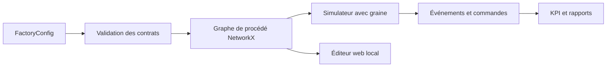

# SylvaPapers — Architecture

## 1. Objectif

SylvaPapers est un monorepo Python 3.12 local pour des expériences de papèterie reproductibles. La
configuration d'usine est la source de vérité commune des machines, types, matières et positions du graphe.

## 2. Frontières des packages

- `sylvapapers_contracts` : contrats Pydantic stricts et export JSON Schema.
- `sylvapapers_digital_twin` : adaptateur graphe, simulation, fiabilité, KPI, rapports et éditeur web.

Le package de contrats n'importe aucun package métier. Le jumeau dépend des contrats, de NetworkX et
des bibliothèques scientifiques standard.

## 3. Graphe de l'usine



Les nœuds conservent les entrées, sorties et coordonnées d'édition. Les arêtes conservent matière,
condition et probabilité. Le contrat générique autorise les cycles, mais la baseline SylvaPapers est
acyclique et ne contient aucune route de recyclage.

## 4. Comportement série et parallèle

La capacité parallèle est représentée par plusieurs `machine_ids` physiques affectés à une opération.
Les recettes alternatives sont représentées par des branches conditionnelles. Sans gamme explicite,
le simulateur dérive une route déterministe avec `metadata.route_condition`.

## 5. Fiabilité

Chaque type de machine possède une densité Weibull à deux paramètres. Le simulateur suit l'âge de
fonctionnement et calcule la probabilité conditionnelle de panne sur l'intervalle de la prochaine
opération. Une graine rend l'historique reproductible.

## 6. Frontière de l'éditeur

Le serveur écoute `127.0.0.1` par défaut, ne sert que des ressources autorisées, valide chaque charge
avec `FactoryConfig`, limite la taille et n'écrit que le fichier configuré. Les modifications doivent
être validées avant que l'écriture explicite soit disponible.

## 7. Flux des données

```text
factory.yaml + simulation_scenario.json
  -> validation Pydantic
  -> graphe éditable / simulation avec graine
  -> events.csv + jobs.csv + kpis.json + summary.json + figures
```

## 8. Critères d'acceptation

- une route papier source-puits existe pour chaque produit actif ;
- toutes les machines et tous les types référencés existent ;
- chaque type expose une forme et une échelle Weibull positives ;
- aucune commande active ne vise un produit désactivé ;
- les pertes sont mesurées sans recyclage ;
- l'import/export de l'éditeur conserve positions et matières ;
- tests, Ruff et mypy strict passent.
