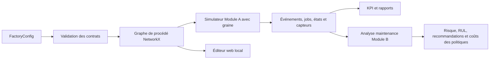

# SylvaPapers — Architecture

## 1. Objectif

SylvaPapers est un monorepo Python 3.12 local pour des expériences de papèterie reproductibles. Le
Module A simule l'usine ; le Module B analyse les preuves de maintenance prédictive. La configuration
d'usine et les contrats publics sont leur source de vérité commune.

## 2. Décision de monorepo modulaire

Le monorepo permet des évolutions atomiques des contrats, moteurs, tests et documents durant la
jeunesse de l'écosystème. La séparabilité repose sur les packages, modèles Pydantic versionnés et
fichiers persistés. Un module peut consommer les contrats et fichiers d'un autre, mais pas importer
son implémentation privée.

## 3. Frontières des packages

- `sylvapapers_contracts` : contrats stricts et export JSON Schema.
- `sylvapapers_digital_twin` : graphe, simulation, instrumentation, KPI et rapports du Module A.
- composants de maintenance prédictive : chargement, EWMA, risque Weibull, RUL, économie et rapports du Module B.
- éditeur web local : édition de l'usine derrière la même frontière `FactoryConfig`.

Le package de contrats n'importe aucun package métier. Les Modules C–E dépendront des contrats
publics et sorties persistées, pas des composants internes du simulateur.

## 4. Graphe de l'usine



Les nœuds conservent entrées, sorties et coordonnées. Les arêtes conservent matière, condition et
probabilité. La baseline SylvaPapers est acyclique et ne contient aucune route de recyclage.

## 5. Comportements série, parallèle et états

La capacité parallèle est représentée par plusieurs `machine_ids` physiques affectés à une opération.
Les branches conditionnelles représentent les recettes. Chaque machine physique conserve ses propres
âge de marche, disponibilité, dégradation, état et historique capteur. Les observations des files et
encours exposent l'accumulation sans transformer le modèle en bilan massique continu.

## 6. Fiabilité et instrumentation

Chaque type de machine possède une densité Weibull à deux paramètres. Le Module A calcule le risque
conditionnel depuis l'âge de marche, augmente la dégradation pendant le travail et émet états, capteurs,
pannes et maintenances structurés. Une graine rend les historiques synthétiques reproductibles.

Le jeu public de capteurs comprend charge, température, vibration, pression, puissance, âge de marche
et dégradation. Unités et qualité accompagnent chaque relevé.

## 7. Frontière du Module A vers B

```text
configurations + commandes
  -> validation et simulation Module A
  -> events.csv + jobs.csv + machine_states.csv + sensors.csv
  -> failures.csv + maintenance.csv + queues.csv + work_in_progress.csv
  -> validation des entrées Module B
  -> EWMA + risque Weibull conditionnel + RUL + comparaison économique
  -> résultats maintenance, recommandations, figures et résumé reproductible
```

Le Module B est en lecture seule vis-à-vis des sorties du Module A. Il produit ses artefacts
consultatifs dans un dossier séparé et ne modifie jamais le paquet de simulation source.

## 8. Frontière éditeur et sécurité

Le serveur écoute `127.0.0.1` par défaut, sert des ressources autorisées, valide les charges avec
`FactoryConfig`, limite leur taille et n'écrit que le fichier configuré. Les modifications doivent
être validées avant l'écriture explicite. Cette frontière locale n'est pas un modèle d'autorisation
pour un déploiement partagé ou en production.

## 9. Intégration des futurs modules

- Les recommandations et fenêtres du Module B deviennent des contraintes du Module C d'allocation.
- Les plannings du Module C reviennent au Module A comme politiques à valider sous incertitude.
- Les scénarios de demande du Module D entrent dans A et consomment service et coûts contraints par la capacité.
- Le Module E consomme goulots, risque et coûts, puis propose des évolutions futures des paramètres.
- Chaque échange emploie des contrats versionnés avec unités, provenance et version de schéma explicites.

## 10. Critères d'acceptation

- chaque produit actif possède une route valide de la source au puits ;
- les machines physiques conservent âge, état et identité d'événement indépendants ;
- le Module A émet des paquets opérationnels et capteurs valides ;
- le Module B rejette les entrées incomplètes et renvoie des résultats traçables par machine ;
- chaque type expose forme et échelle Weibull positives ;
- aucun rejet n'est compté comme production acceptée ni recyclé ;
- des entrées et une graine identiques reproduisent les mêmes résultats synthétiques ;
- tests, Ruff, mypy strict et parité documentaire bilingue passent.
