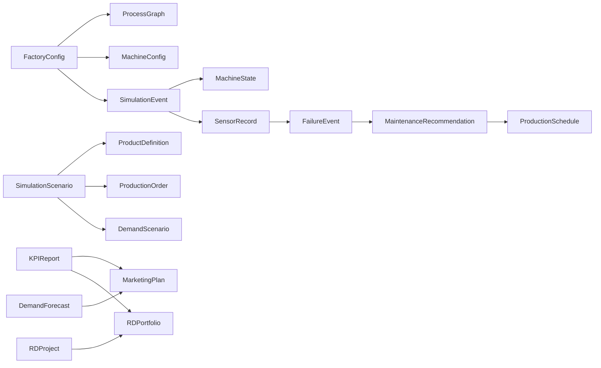

# Data contracts

## 1. Purpose

`asteria_contracts` is the only package that every business module may import. It defines versioned
Pydantic v2 models, UTF-8 YAML/JSON loaders and deterministic JSON Schema exports. It contains no
simulation, prediction or optimization algorithm.

## 2. Common metadata

Every top-level contract inherits two fields:

| Field | Type | Unit | Allowed values | Required | Meaning |
|---|---|---|---|---|---|
| `schema_version` | semantic-version string | none | `major.minor.patch` | Has default `1.0.0` | Version of the serialized contract |
| `provenance` | non-empty string | none | Declared source or `synthetic-*` label | Has default `asteria` | Origin and evidence status |

Values supplied by this repository use `synthetic-engineering-assumptions`. They must never be
presented as measured industrial data.

## 3. Primitive and unit conventions

| Concept | Representation |
|---|---|
| Absolute time | ISO 8601 `datetime` with an explicit offset |
| Simulated duration | Non-negative minutes unless the field states another unit |
| Quantity | Numeric value plus an explicit `*_unit` field |
| Energy | `kWh` in exported KPI and event records |
| Power | `kW` in machine configuration metadata |
| Cost | Synthetic currency units, never labelled as an audited currency |
| Probability or rate | Floating-point value in `[0, 1]` |
| Identifier | Stable, non-empty string scoped by contract type |

## 4. Factory and simulation contracts

| Contract | Description | Core fields and types | Units and allowed values | Example |
|---|---|---|---|---|
| `FactoryConfig` | Factory boundary and resources | `factory_id: str`, `machines: list[MachineConfig]`, `process_graph: ProcessGraph`, calendars | Time zone is an IANA name; referenced machines must exist | `asteria-demo` |
| `ProcessGraph` | Directed routing, including bounded rework | `nodes: list[ProcessNode]`, `edges: list[ProcessEdge]` | Edge probabilities, when present, are in `[0,1]` | QC pass/fail branch |
| `MachineConfig` | Capacity and reliability of one equipment item | ID, name, capabilities, `capacity_per_hour: float`, availability, optional MTBF/MTTR | Capacity unit is explicit; availability is `(0,1]`; MTBF/MTTR in hours | `autoclave-01` |
| `ProductDefinition` | Product route, processing times and bill of materials | product ID, `routing: list[str]`, cycle-time and BOM mappings | Cycle times are positive minutes; BOM quantities are positive | `panel-a` |
| `ProductionOrder` | Dated production demand | order/product IDs, quantity, release/due dates, priority | Quantity is positive; priority is `1..10`; due is after release | `order-001` |
| `DemandScenario` | Time-indexed requested quantities | scenario ID, name, `points: list[DemandPoint]` | Quantities are non-negative with an explicit unit | weekly baseline |
| `SimulationScenario` | Reproducible experiment definition | factory ID, horizon, products, orders, seed, fidelity, rework limit | Fidelity is `fast`, `standard` or `research`; seed is non-negative | `baseline-week-01` |
| `SimulationEvent` | Immutable event-journal row | event ID, timestamp, event/entity types and optional duration/payload | Duration is non-negative minutes | operation completed |
| `MachineState` | Time-stamped operational state | machine ID, timestamp, status, utilization, active order | Status is a controlled enum; utilization is in `[0,1]` | autoclave failed |

## 5. Maintenance contracts

| Contract | Description | Core fields and types | Units and allowed values | Example |
|---|---|---|---|---|
| `SensorRecord` | Contextual machine observation | sensor/machine IDs, timestamp, value and unit mappings, quality | Each value has exactly one unit; quality is `good`, `uncertain` or `bad` | vibration in `mm/s` |
| `FailureEvent` | Observed equipment failure | failure/machine IDs, occurrence time, type, downtime and cost | Downtime is non-negative minutes; cost is non-negative synthetic currency | autoclave pressure fault |
| `MaintenanceRecommendation` | Proposed intervention with uncertainty | machine ID, action, risk, recommended window and expected cost | Probability/confidence in `[0,1]`; end is after start | inspect within 8 h |

## 6. Resource-allocation contracts

| Contract | Description | Core fields and types | Units and allowed values | Example |
|---|---|---|---|---|
| `ResourceCalendar` | Weekly shifts and exceptions | resource ID, time zone, weekday and exception mappings | Shift strings use local `HH:MM-HH:MM` intervals | operator-team |
| `ProductionSchedule` | Versioned set of feasible assignments | schedule/scenario IDs, generation time, assignments, objective | Assignment end is after start; cost/delay are non-negative | baseline schedule |

## 7. Marketing contracts

| Contract | Description | Core fields and types | Units and allowed values | Example |
|---|---|---|---|---|
| `MarketingPlan` | Capacity-aware channel allocation | plan ID, period, total budget and campaigns | Campaign spend and total budget are non-negative synthetic currency | technical-content plan |
| `DemandForecast` | Probabilistic demand by product and period | forecast ID, generation time, horizon, method and quantile points | Quantiles obey `p10 <= p50 <= p90`; quantities are panels by default | weekly forecast |

## 8. R&D and KPI contracts

| Contract | Description | Core fields and types | Units and allowed values | Example |
|---|---|---|---|---|
| `RDProject` | Candidate research project | ID, stage, budget, dates, TRL and expected value | TRL is `1..9`; budget/value are synthetic currency | fast-cure resin |
| `RDPortfolio` | Feasible selected-project set | portfolio ID, budget limit and projects | Sum of project budgets must not exceed the limit | materials 2027 |
| `KPIReport` | Versioned metric collection for one period | report/scenario IDs, start/end and named metrics | End is after start; every metric declares value and unit | fast baseline KPI |

## 9. Relations and validation order

Validation proceeds from syntax and types, to value ranges and units, then local relationships such as
machine references, product references, dates, quantiles and portfolio budgets.

## 10. Serialization and examples

Human-edited configuration uses YAML, compact scenarios use JSON, readable event examples may use
CSV, and later large tables will use Parquet. The first-delivery examples are:

- `configs/factory.yaml`;
- `configs/scenarios/baseline.yaml`;
- `data/examples/simulation_scenario.json`;
- the 19 generated schemas in `schemas/*.schema.json`.

## 11. Schema evolution

Additive optional fields increment the minor version. Breaking renames, unit changes or semantic
changes increment the major version. A consumer must reject an unsupported major version rather than
guessing its meaning.

## 12. Acceptance criteria

- All 19 required top-level contracts export valid deterministic JSON Schema.
- Valid examples load from UTF-8 YAML/JSON and invalid references, units, dates, quantiles and budgets fail.
- Every contract carries a schema version and provenance.
- Business packages exchange serialized contracts or public objects, never internal implementation objects.

