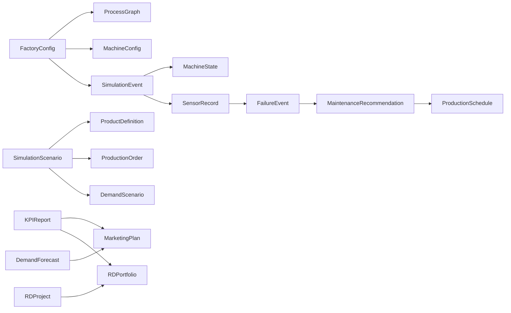

# Contrats de données

## 1. Objectif

`asteria_contracts` est le seul package importable par tous les modules métier. Il définit des modèles
Pydantic v2 versionnés, des chargeurs YAML/JSON UTF-8 et des exports déterministes de schémas JSON. Il
ne contient aucun algorithme de simulation, prédiction ou optimisation.

## 2. Métadonnées communes

Chaque contrat de premier niveau hérite de deux champs :

| Champ | Type | Unité | Valeurs autorisées | Obligatoire | Signification |
|---|---|---|---|---|---|
| `schema_version` | chaîne de version sémantique | aucune | `majeur.mineur.correctif` | Valeur par défaut `1.0.0` | Version du contrat sérialisé |
| `provenance` | chaîne non vide | aucune | Source déclarée ou étiquette `synthetic-*` | Valeur par défaut `asteria` | Origine et statut de preuve |

Les valeurs fournies par ce dépôt utilisent `synthetic-engineering-assumptions`. Elles ne doivent
jamais être présentées comme des mesures industrielles.

## 3. Conventions primitives et unités

| Concept | Représentation |
|---|---|
| Temps absolu | `datetime` ISO 8601 avec décalage explicite |
| Durée simulée | Minutes non négatives sauf autre unité indiquée par le champ |
| Quantité | Valeur numérique avec champ `*_unit` explicite |
| Énergie | `kWh` dans les KPI et événements exportés |
| Puissance | `kW` dans les métadonnées de configuration machine |
| Coût | Unités monétaires synthétiques, jamais présentées comme une devise auditée |
| Probabilité ou taux | Valeur flottante dans `[0, 1]` |
| Identifiant | Chaîne stable et non vide dans le périmètre du type de contrat |

## 4. Contrats usine et simulation

| Contrat | Description | Champs principaux et types | Unités et valeurs autorisées | Exemple |
|---|---|---|---|---|
| `FactoryConfig` | Périmètre de l’usine et ressources | `factory_id: str`, `machines: list[MachineConfig]`, `process_graph: ProcessGraph`, calendriers | Le fuseau est un nom IANA ; les machines référencées existent | `asteria-demo` |
| `ProcessGraph` | Routage orienté avec reprise bornée | `nodes: list[ProcessNode]`, `edges: list[ProcessEdge]` | Les probabilités d’arêtes éventuelles sont dans `[0,1]` | Branche QC conforme/non conforme |
| `MachineConfig` | Capacité et fiabilité d’un équipement | ID, nom, capacités, `capacity_per_hour: float`, disponibilité, MTBF/MTTR facultatifs | Unité de capacité explicite ; disponibilité dans `(0,1]` ; MTBF/MTTR en heures | `autoclave-01` |
| `ProductDefinition` | Gamme produit, temps et nomenclature | ID produit, `routing: list[str]`, dictionnaires de temps et matières | Temps de cycle en minutes positives ; quantités matières positives | `panel-a` |
| `ProductionOrder` | Demande de production datée | IDs commande/produit, quantité, dates de lancement/échéance, priorité | Quantité positive ; priorité `1..10` ; échéance après lancement | `order-001` |
| `DemandScenario` | Quantités demandées indexées dans le temps | ID scénario, nom, `points: list[DemandPoint]` | Quantités non négatives avec unité explicite | baseline hebdomadaire |
| `SimulationScenario` | Définition d’expérience reproductible | ID usine, horizon, produits, commandes, graine, fidélité, limite de reprise | Fidélité `fast`, `standard` ou `research` ; graine non négative | `baseline-week-01` |
| `SimulationEvent` | Ligne immuable du journal d’événements | ID événement, horodatage, types d’événement/entité, durée et payload facultatifs | Durée non négative en minutes | opération terminée |
| `MachineState` | État opérationnel horodaté | ID machine, horodatage, statut, utilisation, commande active | Statut dans une enum contrôlée ; utilisation dans `[0,1]` | autoclave en panne |

## 5. Contrats de maintenance

| Contrat | Description | Champs principaux et types | Unités et valeurs autorisées | Exemple |
|---|---|---|---|---|
| `SensorRecord` | Observation contextualisée d’une machine | IDs capteur/machine, horodatage, dictionnaires valeurs/unités, qualité | Chaque valeur a exactement une unité ; qualité `good`, `uncertain` ou `bad` | vibration en `mm/s` |
| `FailureEvent` | Panne d’équipement observée | IDs panne/machine, date, type, arrêt et coût | Arrêt en minutes non négatives ; coût synthétique non négatif | défaut de pression autoclave |
| `MaintenanceRecommendation` | Intervention proposée avec incertitude | ID machine, action, risque, fenêtre recommandée et coût attendu | Probabilité/confiance dans `[0,1]` ; fin après début | inspection sous 8 h |

## 6. Contrats d’allocation des ressources

| Contrat | Description | Champs principaux et types | Unités et valeurs autorisées | Exemple |
|---|---|---|---|---|
| `ResourceCalendar` | Équipes hebdomadaires et exceptions | ID ressource, fuseau, dictionnaires jours et exceptions | Intervalles locaux sous forme `HH:MM-HH:MM` | operator-team |
| `ProductionSchedule` | Ensemble versionné d’affectations faisables | IDs planning/scénario, date de génération, affectations, objectif | Fin d’affectation après début ; coûts/retards non négatifs | planning baseline |

## 7. Contrats marketing

| Contrat | Description | Champs principaux et types | Unités et valeurs autorisées | Exemple |
|---|---|---|---|---|
| `MarketingPlan` | Allocation des canaux limitée par la capacité | ID plan, période, budget total et campagnes | Dépenses et budget non négatifs en monnaie synthétique | plan de contenu technique |
| `DemandForecast` | Demande probabiliste par produit et période | ID prévision, génération, horizon, méthode et points quantiles | Quantiles `p10 <= p50 <= p90` ; panneaux par défaut | prévision hebdomadaire |

## 8. Contrats R&D et KPI

| Contrat | Description | Champs principaux et types | Unités et valeurs autorisées | Exemple |
|---|---|---|---|---|
| `RDProject` | Projet de recherche candidat | ID, stade, budget, dates, TRL et valeur attendue | TRL `1..9` ; budget/valeur en monnaie synthétique | résine à cuisson rapide |
| `RDPortfolio` | Ensemble faisable de projets sélectionnés | ID portefeuille, limite budgétaire et projets | La somme des budgets ne dépasse pas la limite | matériaux 2027 |
| `KPIReport` | Ensemble versionné de métriques sur une période | IDs rapport/scénario, début/fin et métriques nommées | Fin après début ; chaque métrique déclare valeur et unité | KPI baseline fast |

## 9. Relations et ordre de validation

La validation traite d’abord syntaxe et types, puis plages de valeurs et unités, enfin relations
locales : références machines/produits, dates, quantiles et budgets de portefeuille.

## 10. Sérialisation et exemples

La configuration éditée manuellement utilise YAML, les scénarios compacts JSON, les exemples
d’événements lisibles peuvent utiliser CSV et les grandes tables futures utiliseront Parquet. Les
exemples de la première livraison sont :

- `configs/factory.yaml` ;
- `configs/scenarios/baseline.yaml` ;
- `data/examples/simulation_scenario.json` ;
- les 19 schémas générés dans `schemas/*.schema.json`.

## 11. Évolution des schémas

Les champs facultatifs ajoutés incrémentent la version mineure. Les renommages, changements d’unité
ou de sémantique incompatibles incrémentent la version majeure. Un consommateur rejette une version
majeure non prise en charge au lieu d’en deviner le sens.

## 12. Critères d’acceptation

- Les 19 contrats principaux exportent un schéma JSON valide et déterministe.
- Les exemples valides se chargent en YAML/JSON UTF-8 et les références, unités, dates, quantiles et budgets invalides échouent.
- Chaque contrat porte une version de schéma et une provenance.
- Les packages métier échangent des contrats sérialisés ou des objets publics, jamais des objets internes.

