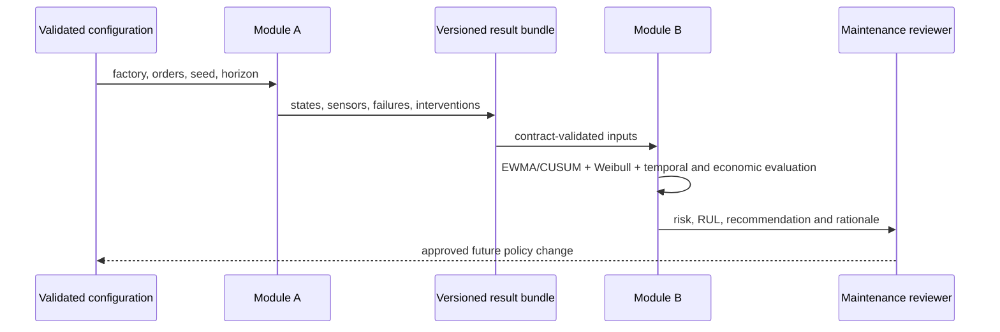
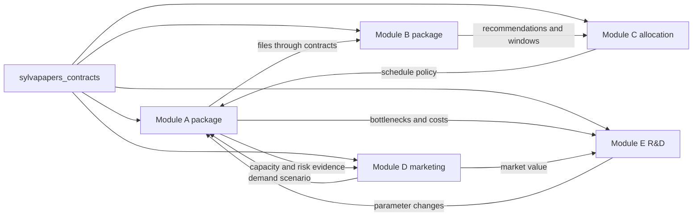

# SylvaPapers — Modules A and B

## 1. Purpose

This document defines the completed baseline boundary between Module A, the paper-mill digital twin,
and Module B, predictive maintenance. It separates implemented behavior from planned extensions and
keeps both modules independently executable through persisted, versioned data contracts.

## 2. Delivery status

| Capability | Status | Evidence boundary |
|---|---|---|
| Configurable directed factory graph | Implemented | validated factory and scenario contracts |
| Seeded discrete-event production | Implemented | reproducible events, jobs, KPI and final state |
| Operating-age Weibull failures | Implemented | machine-specific age, failures and downtime |
| Synthetic degradation and sensors | Implemented | timestamped sensor and state exports |
| Controlled quality recycling | Implemented | bounded QC-to-stock-preparation feedback and conservation counters |
| Long statistical campaign | Implemented | 100 × 2,000 rolls, 21 KPI distributions and bootstrap 95% confidence intervals |
| Interpretable maintenance analysis | Implemented | EWMA/CUSUM, robust thresholds, Weibull risk and RUL |
| Maintenance recommendations | Implemented | machine-level alert, rationale and intervention window |
| Economic policy comparison | Implemented baseline | corrective, preventive and predictive synthetic costs |
| Leakage-free temporal validation | Implemented baseline | rolling origins, censoring, confusion and calibration exports |
| Industrial calibration | Not implemented | approved mill histories are required |
| Cost-sensitive lost-revenue ML | Implemented baseline | ordered holdout, Poisson gradient boosting and intervention ranking |
| Closed-loop equipment control | Explicitly out of scope | advisory output and human review only |

## 3. Module A — digital twin

### 3.1 Business problem

Module A estimates how orders, product routes, parallel capacity, failures, maintenance and quality
interact in a configurable paper mill. Its role is to generate consistent operational evidence for
analysis, not to reproduce fine fibre, fluid or thermal physics.

### 3.2 Inputs

| Input | Role | Provenance in the baseline |
|---|---|---|
| Factory graph and machine types | topology, capacity and Weibull coefficients | synthetic engineering assumption |
| Product definitions and orders | routes, quantities and dates | synthetic example |
| Simulation seed and horizon | reproducibility and termination | explicit experiment setting |
| Process, quality, energy and cost parameters | event duration and KPI | synthetic engineering assumption |
| Maintenance recovery and repair parameters | virtual-age and availability effects | synthetic engineering assumption |
| Recycling policy | return edge, recovery yield and maximum loop count | synthetic engineering assumption |

### 3.3 Outputs

| Artefact | Purpose |
|---|---|
| `events.csv` | unified production, quality, failure and maintenance journal |
| `jobs.csv` | order and roll outcomes |
| `machine_states.csv` | timestamped equipment operating state |
| `sensors.csv` | synthetic condition-monitoring channels with units |
| `failures.csv` | structured failure history |
| `maintenance.csv` | completed maintenance actions and effects |
| `queues.csv` | queue observations by process step |
| `work_in_progress.csv` | timestamped WIP observations |
| `recycling.csv` | every recovery attempt, outcome, pass count and final-loss reason |
| `failure_economic_impacts.csv` | topology-aware revenue exposure and lost revenue per failure |
| `revenue.csv` | hourly recognized revenue, cumulative revenue, costs, margin and counterfactual |
| `kpis.json` | aggregated production, quality, downtime, cost and energy indicators |
| `final_state.json` | terminal machine, queue and production state |
| `summary.json` | seed, versions, runtime, configuration and result counts |
| `machine_gantt.png`, `queue_history.png`, `energy_by_machine.png` | reproducible operational figures |

The sensor channels are `load_ratio`, `temperature_c`, `vibration_mm_s`, `pressure_bar`,
`power_kw`, `operating_age_hours` and `degradation_index`. They are generated from the simulation
state and synthetic noise; they are not physical measurements.

The reference feedback loop goes from `quality-control` to `stock-preparation`. Its configured yield
of `0.75` is applied as a seeded Bernoulli recovery probability to each rejected `roll_equivalent`,
with `max_loops: 2`. Recovered units re-enter all downstream operations. Unrecovered units and those
reaching the loop limit are final losses. The implementation conserves unit entities and counts
internal recycled throughput, but it does not model continuous fibre mass, moisture or pulp yield.

### 3.4 Long-run statistics

`configs/campaigns/long_run.yaml` defines 100 independent replications, 2,000 planned jobs per
replication, 45-minute inter-arrivals and a 120-day horizon extension. The campaign computes 21 KPI
distributions, R-7 empirical quantiles and a seeded non-parametric bootstrap 95% confidence interval
for each mean. It also exports product-by-replication and machine-by-replication evidence.

Hourly machine costs and product prices are explicit synthetic hypotheses in EUR. A failure on a
common series step receives the full active revenue exposure. A failure on a product branch receives
the revenue-weighted affected-product share; parallel machines further divide that share according
to fixed nominal capacity. No catch-up speed is credited. Accepted finished rolls recognize revenue.

## 4. Module B — predictive maintenance

### 4.1 Business problem

Module B ranks machine attention using the evidence generated by Module A. It combines current
condition, operating age, machine criticality and intervention economics while keeping every
recommendation traceable to simple, reviewable methods.

### 4.2 Inputs

| Input | Required use |
|---|---|
| Sensor records | estimate drift and current condition |
| Machine states | align condition with load and operating context |
| Failure events | evaluate outcomes and policy cost |
| Maintenance interventions | reconstruct recent maintenance context |
| Factory machine types | obtain Weibull shape and scale |
| Maintenance configuration | thresholds, horizon, costs and policy settings |

### 4.3 Methods

| Method | Baseline role | Interpretation limit |
|---|---|---|
| EWMA | smooth sensor deviations and retain recent drift | not a causal diagnosis |
| Robust two-sided CUSUM | detect persistent positive or negative shifts | shares the same frozen reference-window limitation as EWMA |
| Robust threshold | flag scores relative to resistant location and scale | depends on baseline representativeness |
| Conditional Weibull risk | estimate failure probability over the horizon from current age | assumes the configured Weibull family |
| Weibull RUL | estimate remaining operating life and uncertainty | not calendar life and not independently calibrated |
| Rule-based recommendation | map evidence and criticality to urgency and action | advisory, not an automatic work order |
| Economic baseline | compare corrective, preventive and predictive expected cost | uses synthetic cost parameters |
| Rolling-origin backtest | compute TP, FP, TN, FN, precision, recall, F1 and alert lead time without future features | overlapping windows are correlated and right-censored windows are excluded |
| Probability calibration | compare conditional Weibull risk with observed failures in equal-width bins | descriptive with small samples or few failures |

Advanced methods such as Cox models, isolation forests, state-space models and conformal
prediction remain candidates. They are not part of the baseline and must demonstrate measurable
value beyond these methods before adoption.

The economic ML baseline uses an `ExtraTreesRegressor` for non-negative expected loss. It is trained on earlier
replications and evaluated on later replications so no target consequence or future replication is
used as an input feature. It predicts non-negative lost revenue and ranks proposed predictive
interventions by expected net benefit. It remains advisory and synthetic.

### 4.4 Outputs

| Artefact | Purpose |
|---|---|
| `maintenance_assessments.json` | anomaly, risk, RUL and recommendation per machine |
| `maintenance_policy_costs.csv` | corrective, preventive and predictive economic comparison |
| `temporal_predictions.csv` | flat rolling-origin predictions, outcomes and censoring flags |
| `temporal_validation_metrics.csv` | EWMA/CUSUM confusion metrics, Brier score and event lead time |
| `probability_calibration.csv` | non-empty Weibull probability bins and observed failure frequency |
| `machine_decision_features.csv` | flat risk, policy, cost and capacity-impact features for Modules C/D/E |
| `module_b_manifest.json` | schema versions, provenance, units, filenames and known limitations |
| `sensor_anomalies.png` | normalized sensor trends and latest anomaly flags |
| `failure_risk_rul.png` | conditional failure risk and RUL intervals |
| `maintenance_policy_costs.png` | expected policy cost by machine |
| `temporal_validation.png` | EWMA/CUSUM precision, recall and F1 on uncensored windows |
| `probability_calibration.png` | predicted Weibull risk against observed failure frequency |
| `machine_economic_priorities.csv` | ML ranking by predicted failure loss and expected net benefit |
| `economic_model_metrics.json` | ordered-holdout MAE, weighted MAE, RMSE, R2 and policy estimate |
| `economic_model_validation.png` | ggplot-style actual-versus-predicted holdout evidence |

Output identifiers remain technical English even when reports are presented in French.

Every campaign interoperability CSV carries `schema_version`, `producer_version`, `provenance` and
`data_classification`.
Probability and capacity fields use ratios, RUL uses operating hours, alert lead time uses calendar
hours, and monetary fields state their currency. These files are self-describing inputs intended for
copying into separate Module D and E repositories; consumers should verify the adjacent manifest
before ingestion.

## 5. Module A to B sequence



The human approval boundary is intentional. Module B never writes to a machine, PLC, CMMS or
production schedule.

## 6. Reproducible execution

```bash
uv run sylvapapers validate-config --config configs/scenarios/baseline.yaml
uv run sylvapapers simulate --config configs/scenarios/baseline.yaml --output outputs/baseline
uv run sylvapapers maintenance --input outputs/baseline --output outputs/maintenance
uv run sylvapapers campaign --config configs/campaigns/long_run.yaml --output outputs/long-run-statistics
```

For an explicit maintenance scenario:

```bash
uv run sylvapapers maintenance --input outputs/baseline --output outputs/maintenance --config configs/maintenance/baseline.yaml
```

A reproducible comparison records configuration, schema version, random seed, code version, runtime,
input paths, output paths and metric counts. Module B must reject a missing or malformed Module A
bundle rather than silently inventing observations.

## 7. Compute profiles

| Profile | Module A use | Module B use | Budget guardrail |
|---|---|---|---:|
| `fast` | short scenario and smoke data | one baseline analysis | < 30 s per simple run |
| `standard` | multi-replication monthly study | policy comparison and figures | < 2 min |
| `research` | optional sensitivity experiments | optional deeper models | < 5 min per default configuration |

The profiles describe intended fidelity and budgets. They are not performance claims until measured
on a named machine and recorded with the experiment.

## 8. Separation and future modules



This repository remains the home of Modules A and B. Modules D and E will be implemented in
separate repositories and will consume copied, versioned CSV/JSON artefacts only. Package boundaries,
versioned schemas, manifests and file-based exchanges prevent those future repositories from
depending on simulator or maintenance internals.

## 9. Deferred work

- continuous dry-tonne, moisture and mass-conservation modelling;
- enforced shifts, workforce skills and maintenance windows;
- interruption policies for failures occurring during an operation;
- censored-data estimation of Weibull coefficients from approved plant histories;
- industrial out-of-sample validation across several failure modes and operating regimes;
- Cox, state-space, conformal or ML comparisons;
- Module C production and technician optimization;
- Module D capacity-aware marketing optimization;
- Module E stochastic R&D portfolio optimization.

## 10. Acceptance boundary

Modules A and B are complete for the synthetic, laptop-scale baseline when clean installation,
configuration validation, deterministic replay, output-contract validation, economic-policy
comparison, bilingual documentation parity, tests, Ruff and strict mypy all pass. This does not
constitute industrial validation or authorization for production use.
