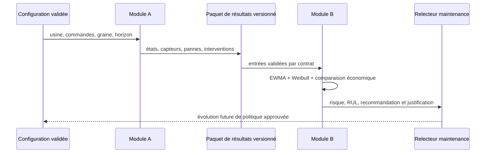
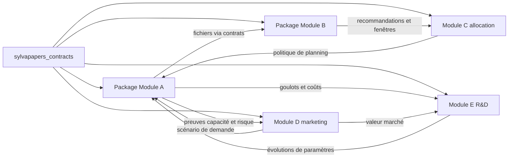

# SylvaPapers — Modules A et B

## 1. Objectif

Ce document définit la frontière de baseline achevée entre le Module A, jumeau numérique de la
papèterie, et le Module B, maintenance prédictive. Il sépare les comportements implémentés des
extensions prévues et maintient les deux modules exécutables indépendamment grâce à des contrats de
données persistés et versionnés.

## 2. État de la livraison

| Capacité | État | Frontière de preuve |
|---|---|---|
| Graphe orienté d'usine configurable | Implémenté | contrats usine et scénario validés |
| Production à événements discrets avec graine | Implémenté | événements, jobs, KPI et état final reproductibles |
| Pannes Weibull selon l'âge de marche | Implémenté | âge, pannes et arrêts propres à chaque machine |
| Dégradation et capteurs synthétiques | Implémenté | exports horodatés des capteurs et états |
| Analyse de maintenance interprétable | Implémenté | EWMA, seuils robustes, risque Weibull et RUL |
| Recommandations de maintenance | Implémenté | alerte, justification et fenêtre par machine |
| Comparaison économique des politiques | Baseline implémentée | coûts synthétiques corrective, préventive et prédictive |
| Étalonnage industriel | Non implémenté | historiques approuvés de papèterie nécessaires |
| Modèles avancés de survie ou ML | Prévus seulement | doivent dépasser la baseline interprétable |
| Commande d'équipements en boucle fermée | Explicitement hors périmètre | sortie consultative et revue humaine uniquement |

## 3. Module A — jumeau numérique

### 3.1 Problème métier

Le Module A estime comment commandes, gammes, capacité parallèle, pannes, maintenance et qualité
interagissent dans une papèterie configurable. Son rôle est de produire des preuves opérationnelles
cohérentes, pas de reproduire finement la physique des fibres, fluides ou transferts thermiques.

### 3.2 Entrées

| Entrée | Rôle | Provenance dans la baseline |
|---|---|---|
| Graphe et types de machine | topologie, capacité et coefficients Weibull | hypothèse d'ingénierie synthétique |
| Produits et commandes | gammes, quantités et dates | exemple synthétique |
| Graine et horizon | reproductibilité et terminaison | réglage explicite de l'expérience |
| Paramètres procédé, qualité, énergie et coût | durées d'événement et KPI | hypothèse d'ingénierie synthétique |
| Paramètres de récupération et réparation | effets sur l'âge virtuel et la disponibilité | hypothèse d'ingénierie synthétique |

### 3.3 Sorties

| Artefact | Objectif |
|---|---|
| `events.csv` | journal unifié production, qualité, panne et maintenance |
| `jobs.csv` | résultats des commandes et rouleaux |
| `machine_states.csv` | état de fonctionnement horodaté des équipements |
| `sensors.csv` | canaux synthétiques de surveillance avec unités |
| `failures.csv` | historique structuré des pannes |
| `maintenance.csv` | actions de maintenance terminées et effets |
| `queues.csv` | observations des files par étape |
| `work_in_progress.csv` | observations horodatées des encours |
| `kpis.json` | indicateurs agrégés de production, qualité, arrêt, coût et énergie |
| `final_state.json` | état terminal des machines, files et production |
| `summary.json` | graine, versions, durée, configuration et comptes |
| `machine_gantt.png`, `queue_history.png`, `energy_by_machine.png` | figures opérationnelles reproductibles |

Les canaux sont `load_ratio`, `temperature_c`, `vibration_mm_s`, `pressure_bar`, `power_kw`,
`operating_age_hours` et `degradation_index`. Ils proviennent de l'état de simulation et d'un bruit
synthétique ; ce ne sont pas des mesures physiques.

## 4. Module B — maintenance prédictive

### 4.1 Problème métier

Le Module B classe les machines à surveiller grâce aux preuves du Module A. Il combine condition
courante, âge de marche, criticité et économie d'intervention tout en gardant chaque recommandation
traçable vers des méthodes simples et vérifiables.

### 4.2 Entrées

| Entrée | Usage requis |
|---|---|
| Relevés capteurs | estimer la dérive et la condition courante |
| États machine | aligner condition, charge et contexte de fonctionnement |
| Événements de panne | évaluer les résultats et le coût des politiques |
| Interventions de maintenance | reconstruire le contexte récent de maintenance |
| Types de machine de l'usine | obtenir forme et échelle Weibull |
| Configuration de maintenance | seuils, horizon, coûts et paramètres de politique |

### 4.3 Méthodes

| Méthode | Rôle dans la baseline | Limite d'interprétation |
|---|---|---|
| EWMA | lisser les écarts capteurs et conserver la dérive récente | pas un diagnostic causal |
| Seuil robuste | signaler les scores selon position et échelle résistantes | dépend de la représentativité de la baseline |
| Risque Weibull conditionnel | estimer la probabilité de panne sur l'horizon depuis l'âge courant | suppose la famille Weibull configurée |
| RUL Weibull | estimer la vie restante en marche et son incertitude | pas une durée calendaire ni un modèle étalonné indépendamment |
| Recommandation par règles | transformer preuves et criticité en urgence et action | consultative, pas un ordre de travail automatique |
| Baseline économique | comparer le coût attendu corrective, préventive et prédictive | utilise des coûts synthétiques |

CUSUM, modèles de Cox, forêts d'isolation, modèles espace-état et prédiction conforme restent des
candidats. Ils ne font pas partie de la baseline et devront démontrer une valeur mesurable avant ajout.

### 4.4 Sorties

| Artefact | Objectif |
|---|---|
| `maintenance_assessments.json` | anomalie, risque, RUL et recommandation par machine |
| `maintenance_policy_costs.csv` | comparaison économique corrective, préventive et prédictive |
| `sensor_anomalies.png` | tendances capteurs normalisées et derniers signaux d'anomalie |
| `failure_risk_rul.png` | risque conditionnel et intervalles RUL |
| `maintenance_policy_costs.png` | coût attendu des politiques par machine |

Les identifiants de sortie restent en anglais technique, même lorsque les rapports sont en français.

## 5. Séquence du Module A vers B



La frontière d'approbation humaine est volontaire. Le Module B n'écrit jamais vers une machine, un
automate, une GMAO ou un planning de production.

## 6. Exécution reproductible

```bash
uv run sylvapapers validate-config --config configs/scenarios/baseline.yaml
uv run sylvapapers simulate --config configs/scenarios/baseline.yaml --output outputs/baseline
uv run sylvapapers maintenance --input outputs/baseline --output outputs/maintenance
```

Pour un scénario de maintenance explicite :

```bash
uv run sylvapapers maintenance --input outputs/baseline --output outputs/maintenance --config configs/maintenance/baseline.yaml
```

Une comparaison reproductible consigne configuration, version de schéma, graine, version du code,
durée, chemins d'entrée et de sortie et comptes de métriques. Le Module B doit rejeter un paquet du
Module A absent ou mal formé au lieu d'inventer silencieusement des observations.

## 7. Profils de calcul

| Profil | Usage Module A | Usage Module B | Budget garde-fou |
|---|---|---|---:|
| `fast` | scénario court et données de vérification | une analyse de baseline | < 30 s par exécution simple |
| `standard` | étude mensuelle multiréplication | comparaison des politiques et figures | < 2 min |
| `research` | sensibilités facultatives | modèles approfondis facultatifs | < 5 min par configuration par défaut |

Les profils décrivent fidélité et budgets visés. Ils ne sont pas des performances annoncées tant
qu'ils ne sont pas mesurés sur une machine nommée et consignés avec l'expérience.

## 8. Séparation et futurs modules



Le monorepo est conservé pour le développement rapide et les changements atomiques de contrats. Les
frontières de packages, schémas versionnés et échanges par fichiers permettront une séparation
ultérieure des dépôts sans modifier les interfaces métier.

## 9. Travaux différés

- modélisation continue en tonnes sèches, humidité et conservation de masse ;
- application des horaires, compétences du personnel et fenêtres de maintenance ;
- politiques d'interruption pour les pannes en cours d'opération ;
- estimation Weibull sur des historiques censurés et approuvés de papèterie ;
- backtesting temporel, courbes d'étalonnage et matrices de confusion temporelles ;
- comparaisons CUSUM, Cox, espace-état, conformes ou ML ;
- optimisation production et techniciens du Module C ;
- optimisation marketing contrainte par la capacité du Module D ;
- optimisation stochastique du portefeuille R&D du Module E.

## 10. Frontière d'acceptation

Les Modules A et B sont achevés pour la baseline synthétique exécutable sur portable lorsque
installation propre, validation, rejeu déterministe, validation des contrats de sortie, comparaison
économique, parité documentaire bilingue, tests, Ruff et mypy strict réussissent. Cela ne constitue ni
une validation industrielle ni une autorisation d'usage en production.
